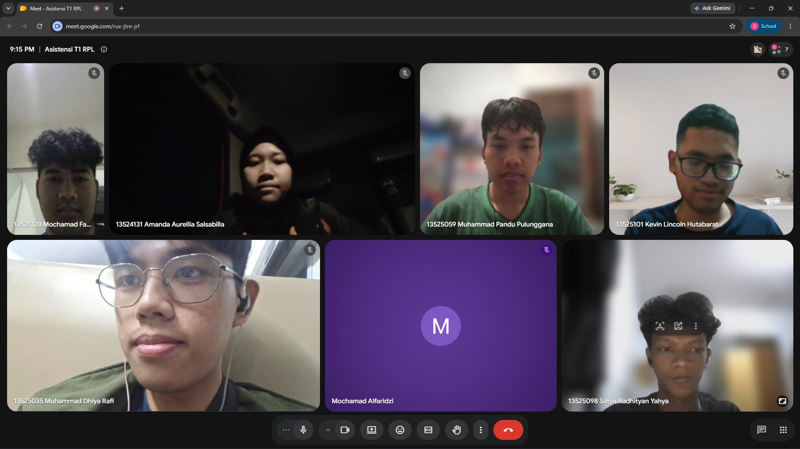

# Form Asistensi

## Tugas Besar IF2150 - Rekayasa Perangkat Lunak

| Informasi | Keterangan |
| --- | --- |
| **Hari** | *Minggu* |

| **Tanggal** | *30/07/2026* |
| **Kelas** | *K02* |
| **Nomor Kelompok** | *G03*  |
| **Nama Kelompok** | *LockedIn*  |
| **Nama Perangkat Lunak** | *SiLembur*  |
| **Dokumen** | *Template T1*  |

### Anggota Kelompok

| NIM | Nama |
|---|---|
| *13525059* | *Muhammad Pandu Pulunggana* |
| *13525128* | *Mochamad Fachri Alfaridzi* |
| *13525101* | *Kevin Lincoln Hutabarat* |
| *13525035* | *Muhammad Dhiya Rafi* |
| *13525098* | *Satya Radhityan Yahya* |

### Catatan

| Catatan |
| --- |
| 1. Ide sudah cukup baik,harus bisa menjelaskan perbedaan solusi yang diajukan dengan solusi yang sudah ada  |
| 2. Tidak harus sangat unik, yang penting ada gap dari solusi sebelumnya |
| 3. Penggunaan AI diperbolehkan, tetapi harus transparan terkait penggunaannya |
| 4. Draft hanya untuk mengecek progres,setelah dokumen final dirilis, tidak boleh direvisi lagi |

## Dokumentasi

<!--  -->

  

  <i>Gambar 1. Dokumentasi kegiatan asistensi.</i>

