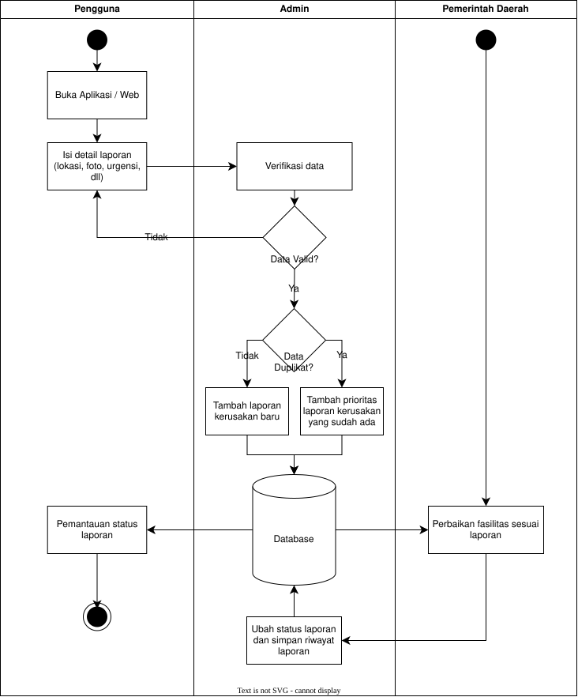

<h1>
IF2150 REKAYASA PERANGKAT LUNAK
 
TUGAS 1
 
TOPIC BRAINSTORMING
</h1>
 

## *SILEMBUR*

### Untuk: *[Nama Asisten]*

Dipersiapkan oleh:
| Informasi | Keterangan |
| --- | --- |
| Kelas | *K02* |
| Kelompok | *G03*  |

| NIM | Nama |
|---|---|
| *13525059* | *Muhammad Pandu Pulunggana* |
| *13525128* | *Mochamad Fachri Alfaridzi* |
| *13525101* | *Kevin Lincoln Hutabarat* |
| *13525035* | *Muhammad Dhiya Rafi* |
| *13525098* | *Satya Radhityan Yahya* |
---

 
 

# BAB 1: Analisis Permasalahan

## 1.1 Latar Belakang Masalah
SILEMBUR atau Sistem Informasi Lembur adalah sebuah platform pelaporan berbasis web dan aplikasi yang memfasilitasi warga untuk melaporkan kerusakan fasilitas umum di lingkungan tempat tinggal mereka seperti jalan berlubang lampu penerangan jalan yang mati dan pohon tumbang di mana nama lembur sendiri diambil dari bahasa Sunda yang berarti kampung atau kawasan tempat tinggal dan sistem ini bekerja dengan cara warga memotret serta menandai lokasi kerusakan melalui GPS kemudian laporan tersebut diteruskan kepada instansi pemerintah kota yang berwenang sekaligus dapat dipantau statusnya secara transparan hingga divisualisasikan dalam peta interaktif untuk membantu pemerintah memprioritaskan perbaikan berdasarkan data yang nyata dan dari sisi keterkaitannya dengan Tujuan Pembangunan Berkelanjutan aplikasi ini paling erat berhubungan dengan SDG 11 yaitu Sustainable Cities and Communities karena mendukung terciptanya kota yang inklusif aman tangguh dan berkelanjutan melalui pengelolaan infrastruktur publik yang lebih baik.

## 1.2 Analisis Kondisi Saat Ini
Saat ini masyarakat dapat melaporkan kerusakan fasilitas publik seperti jalan berlubang, lampu jalan mati, pohon tumbang, rambu rusak, atau fasilitas umum lainnya melalui berbagai kanal, seperti media sosial, call center instansi, SP4N-LAPOR, maupun aplikasi pemerintah daerah seperti JAKI/JakLapor.

Kanal tersebut sudah mempermudah masyarakat menyampaikan pengaduan. Namun, untuk kasus kerusakan fasilitas publik masih terdapat beberapa celah karena sistem yang ada umumnya berorientasi pada laporan pengaduan, bukan pada pengelolaan kondisi dan riwayat fasilitas yang dilaporkan.

## Kesenjangan yang Teridentifikasi

| Kesenjangan | Kondisi Saat Ini | Dampak |
|---|---|---|
| **Laporan duplikat** | Beberapa warga dapat melaporkan kerusakan yang sama secara terpisah | Petugas perlu memeriksa laporan berulang untuk objek yang sama |
| **Informasi kerusakan tidak selalu seragam** | Detail laporan banyak bergantung pada deskripsi bebas dari pelapor | Jenis, tingkat kerusakan, dan urgensi perlu diverifikasi kembali |
| **Riwayat fasilitas sulit ditelusuri** | Laporan umumnya disimpan sebagai pengaduan terpisah | Kerusakan berulang pada fasilitas yang sama sulit diidentifikasi |
| **Prioritas penanganan belum langsung terlihat** | Laporan dengan tingkat bahaya berbeda dapat masuk melalui mekanisme yang sama | Kerusakan yang lebih berbahaya berpotensi terlambat diprioritaskan |
| **Status penanganan masih umum** | Status biasanya berupa diterima, diproses, atau selesai | Masyarakat tidak selalu mengetahui perkembangan perbaikan secara rinci |

## Perbandingan Solusi yang Sudah Ada

| Solusi | Fitur/Kelebihan | Keterbatasan terhadap Fokus Sistem |
|---|---|---|
| **SP4N-LAPOR** | Kanal pengaduan nasional dan laporan dapat diteruskan kepada instansi berwenang | Bersifat umum untuk berbagai jenis pelayanan publik, bukan khusus pengelolaan kerusakan fasilitas |
| **JAKI/JakLapor** | Mendukung foto, kategori, lokasi, dan pemantauan laporan | Berorientasi pada pengaduan warga dan cakupannya terbatas pada DKI Jakarta |
| **Call center instansi** | Memungkinkan komunikasi langsung dengan petugas | Data laporan tidak selalu terstruktur dan perkembangan laporan lebih sulit dipantau |
| **Media sosial instansi** | Mudah diakses masyarakat | Tidak dirancang sebagai sistem pengelolaan laporan dan riwayat fasilitas |

## Bukti Pendukung

Data nasional SP4N-LAPOR menunjukkan bahwa pengaduan masyarakat memang digunakan dalam skala besar.

| Data | Nilai |
|---|---:|
| Laporan masuk tahun 2023 | *176.853 laporan* |
| Kenaikan dibandingkan 2022 | *30%* |
| Persentase tindak lanjut tahun 2023 | *85,2%* |

Sumber: Kementerian PANRB, *Evaluasi Pengelolaan Pengaduan SP4N-LAPOR! Tahun 2023*.

Contoh data dari kanal resmi Pemerintah Kota Pontianak juga menunjukkan bahwa infrastruktur jalan menjadi topik pengaduan terbanyak pada statistik SP4N-LAPOR! November 2020.

 
<i>Gambar 1. Statistik pengaduan warga, Sumber: Diskominfo Kota Pontianak.</i>

Berdasarkan kondisi tersebut, perangkat lunak yang diusulkan difokuskan pada pelaporan dan pengelolaan kerusakan fasilitas publik secara lebih terstruktur terutama untuk mengurangi laporan duplikat, membantu menentukan prioritas penanganan, serta menyimpan riwayat kerusakan dan perbaikan fasilitas.

---

# BAB 2: Analisis Solusi

## 2.1 Deskripsi Perangkat Lunak

Target platform yang akan dipakai SILEMBUR adalah aplikasi/web mobile. Aplikasi/web mobile dipilih agar pengguna dapat melapor pada waktu dan lokasi pada saat itu juga. Pengguna akan melapor dengan memberikan detail yang dibutuhkan seperti lokasi, foto kerusakan dan waktu pelaporan.

Dari beberapa kondisi yang ada, inovasi inti yang diberikan dari SILEMBUR yang membedakan dengan solusi-solusi yang sudah ada adalah pelaporan kerusakan fasilitas yang lebih terstruktur dengan pengelolaan laporan duplikat serta penyimpanan status dan riwayat laporan fasilitas.

Dengan adanya pengelolaan laporan duplikat, instansi dapat dengan mudah mengatur prioritas dalam penanganan kerusakan. Status dan riwayat laporan akan membantu pengguna/pelapor dalam pemantauan penanganan fasilitas dan membantu instansi dalam menentukan solusi penanganan yang tepat.

## 2.2 Asumsi dan Batasan

Jika foto terkait kerusakan fasilitas mengandung melibatkan wajah orang lain, maka foto yang diupload harus memenuhi UU PDP 27 Tahun 2022 terkait penyebaran data pribadi dengan persetujuan orang yang bersangkutan.

Sumber daya berupa penyimpanan database yang terbatas berarti bahwa tidak semua foto yang dikirim pengguna bisa disimpan secara permanen. Jika database hampir penuh, maka bisa diterapkan penghapusan foto yang dikirim pengguna setelah dicek atau setelah melewati jangka waktu tertentu.

Sistem diasumsikan digunakan di sekitar tempat tinggal atau tempat berkegiatan pengguna, karena paling relevan dengan kondisi mereka. Pengguna biasanya menggunakan berbagai fasilitas dalam aktivitas hidupnya, baik di lingkungan rumah, sekolah, kantor, perjalanan, dan lainnya, sehingga mereka bisa melaporkan ketika ada fasilitas rusak yang menghambat kegiatan mereka.

# BAB 3: Spesifikasi Kebutuhan dan Proses Bisnis

## 3.1 Identifikasi Aktor
| Aktor | Deskripsi |
| :--- | :--- |
| *Masyarakat umum* | *Pengguna ini bertindak sebagai pihak yang melaporkan dan melampirkan bukti fasilitas-fasilitas umum yang rusak kepada sistem. Karakteristik dari pengguna ini adalah mencari kemudahan dalam menggunakan aplikasi.* |
| *Admin* | *Pengguna ini bertindak sebagai verifikator bukti dan lokasi fasilitas-fasilitas umum yang rusak yang telah dilaporkan oleh pengguna dari pihak masyarakat umum. Karakteristik dari pengguna ini adalah mengutamakan kecepatan dan keakuratan dalam memverifikasi suatu laporan.* |
| *Pemerintah daerah* | *Pengguna ini bertindak sebagai pihak perencana dan pelaksana tindakan-tindakan yang harus dilakukan setelah menerima laporan fasilitas-fasilitas umum yang rusak. Karakteristik dari pengguna ini adalah mencari kemudahan dalam mendapatkan laporan.* |

## 3.2 Kebutuhan Pengguna Awal

| ID | Aktor | Kebutuhan / Aktivitas | Tujuan / Nilai |
| :--- | :--- | :--- | :--- |
| US-01 | *Masyarakat umum* |  *Memfoto fasilitas rusak* | *Melaporkan fasilitas kepada pihak yang bertanggung jawab agar dapat diperbaiki* |
| US-02 | *Admin* | *Verifikasi foto* | *Memastikan foto yang dikirim pengguna terkait kerusakan fasilitas * |
| US-03 | *Pemerintah daerah* | *Melakukan tindakan perbaikan* | *Melakukan perbaikan fasilitas sesuai laporan demi kelancaran aktivitas masyarakat* |

## 3.3 Deskripsi Aktivitas
| ID | Aktivitas | Penjelasan | ID User Story |
| :--- | :--- | :--- | :--- |
| A01 | *Melakukan pelaporan* | *Pengguna melapor dengan mengisi detail laporan.* | *US-01* |
| A02 | *Cek validasi* | *Memastikan laporan yang diberikan pengguna valid. Jika tidak valid, pengguna dapat merevisi laporannya.* | *US-02*|
| A03 | *Cek duplikat* | *Memastikan tidak ada laporan duplikat pada database.* | *US-02*|
| A04 | *Perbaikan fasilitas* | *Pemerintah memperbaiki fasilitas sesuai dengan laporan yang ada dengan memperhatikan prioritas.* |  *US-03*
| A05 | *Pembaruan status laporan* | *Mengubah status laporan yang sudah diperbaiki dan memnyimapannya pada riwayat laporan.* | *US-02*
| A06 | *Pemantauan status laporan* | *Memantau proses dan riwayat laporan.* | *US-01*

## 3.4 Model Proses Bisnis
 

<i>Gambar 2. Activity Diagram</i>

 

# Referensi
- Diagram UML: https://www.drawio.com/, https://staruml.io/
- [Evaluasi Pengelolaan Pengaduan SP4N-LAPOR! Tahun 2023](https://menpan.go.id/site/berita-terkini/kementerian-panrb-minta-instansi-pusat-tindak-lanjuti-hasil-evaluasi-pengelolaan-pengaduan)
