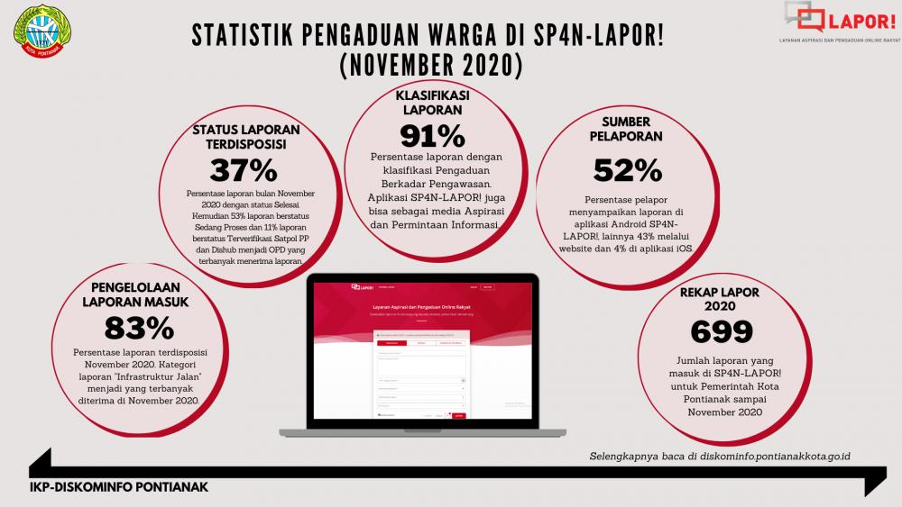

<h1>
IF2150 REKAYASA PERANGKAT LUNAK
 
TUGAS 1
 
TOPIC BRAINSTORMING
</h1>
 

## *Nama Perangkat Lunak*

### Untuk: *[Nama Asisten]*

Dipersiapkan oleh:
| Informasi | Keterangan |
| --- | --- |
| Kelas | *K02* |
| Kelompok | *G03*  |

| NIM | Nama |
|---|---|
| *13525059* | *Muhammad Pandu Pulunggana* |
| *13525128* | *Mochamad Fachri Alfaridzi* |
| *13525101* | *Kevin Lincoln Hutabarat* |
| *13525035* | *Muhammad Dhiya Rafi* |
| *13525098* | *Satya Radhityan Yahya* |
---

 
 

# BAB 1: Analisis Permasalahan

## 1.1 Latar Belakang Masalah
Tuliskan deskripsi permasalahan yang kalian pilih secara naratif dan spesifik. Tambahkan keterkaitan permasalahan tersebut dengan Tujuan Pembangunan Berkelanjutan (SDGs) yang telah disepakati. Dukung argumen kalian dengan data yang kredibel, serta jelaskan urgensi mengapa masalah ini perlu dan layak untuk segera diselesaikan.

## 1.2 Analisis Kondisi Saat Ini
Saat ini masyarakat dapat melaporkan kerusakan fasilitas publik seperti jalan berlubang, lampu jalan mati, pohon tumbang, rambu rusak, atau fasilitas umum lainnya melalui berbagai kanal, seperti media sosial, call center instansi, SP4N-LAPOR, maupun aplikasi pemerintah daerah seperti JAKI/JakLapor.

Kanal tersebut sudah mempermudah masyarakat menyampaikan pengaduan. Namun, untuk kasus kerusakan fasilitas publik masih terdapat beberapa celah karena sistem yang ada umumnya berorientasi pada laporan pengaduan, bukan pada pengelolaan kondisi dan riwayat fasilitas yang dilaporkan.

## Kesenjangan yang Teridentifikasi

| Kesenjangan | Kondisi Saat Ini | Dampak |
|---|---|---|
| **Laporan duplikat** | Beberapa warga dapat melaporkan kerusakan yang sama secara terpisah | Petugas perlu memeriksa laporan berulang untuk objek yang sama |
| **Informasi kerusakan tidak selalu seragam** | Detail laporan banyak bergantung pada deskripsi bebas dari pelapor | Jenis, tingkat kerusakan, dan urgensi perlu diverifikasi kembali |
| **Riwayat fasilitas sulit ditelusuri** | Laporan umumnya disimpan sebagai pengaduan terpisah | Kerusakan berulang pada fasilitas yang sama sulit diidentifikasi |
| **Prioritas penanganan belum langsung terlihat** | Laporan dengan tingkat bahaya berbeda dapat masuk melalui mekanisme yang sama | Kerusakan yang lebih berbahaya berpotensi terlambat diprioritaskan |
| **Status penanganan masih umum** | Status biasanya berupa diterima, diproses, atau selesai | Masyarakat tidak selalu mengetahui perkembangan perbaikan secara rinci |

## Perbandingan Solusi yang Sudah Ada

| Solusi | Fitur/Kelebihan | Keterbatasan terhadap Fokus Sistem |
|---|---|---|
| **SP4N-LAPOR** | Kanal pengaduan nasional dan laporan dapat diteruskan kepada instansi berwenang | Bersifat umum untuk berbagai jenis pelayanan publik, bukan khusus pengelolaan kerusakan fasilitas |
| **JAKI/JakLapor** | Mendukung foto, kategori, lokasi, dan pemantauan laporan | Berorientasi pada pengaduan warga dan cakupannya terbatas pada DKI Jakarta |
| **Call center instansi** | Memungkinkan komunikasi langsung dengan petugas | Data laporan tidak selalu terstruktur dan perkembangan laporan lebih sulit dipantau |
| **Media sosial instansi** | Mudah diakses masyarakat | Tidak dirancang sebagai sistem pengelolaan laporan dan riwayat fasilitas |

## Bukti Pendukung

Data nasional SP4N-LAPOR menunjukkan bahwa pengaduan masyarakat memang digunakan dalam skala besar.

| Data | Nilai |
|---|---:|
| Laporan masuk tahun 2023 | *176.853 laporan* |
| Kenaikan dibandingkan 2022 | *30%* |
| Persentase tindak lanjut tahun 2023 | *85,2%* |

Sumber: Kementerian PANRB, *Evaluasi Pengelolaan Pengaduan SP4N-LAPOR! Tahun 2023*.

Contoh data dari kanal resmi Pemerintah Kota Pontianak juga menunjukkan bahwa infrastruktur jalan menjadi topik pengaduan terbanyak pada statistik SP4N-LAPOR! November 2020.

*Sumber gambar: Diskominfo Kota Pontianak.*

Berdasarkan kondisi tersebut, perangkat lunak yang diusulkan difokuskan pada pelaporan dan pengelolaan kerusakan fasilitas publik secara lebih terstruktur terutama untuk mengurangi laporan duplikat, membantu menentukan prioritas penanganan, serta menyimpan riwayat kerusakan dan perbaikan fasilitas.

---

# BAB 2: Analisis Solusi

## 2.1 Deskripsi Perangkat Lunak
Abstraksikan solusi perangkat lunak yang diusulkan dari sudut pandang pengguna. Jelaskan target platform yang akan digunakan (misalnya: desktop application) beserta alasan pemilihannya. Deskripsikan juga nilai unik (inovasi inti) dari perangkat lunak kalian dan apa yang membedakannya dari solusi yang sudah ada.

## 2.2 Asumsi dan Batasan

Jika foto terkait kerusakan fasilitas mengandung melibatkan wajah orang lain, maka foto yang diupload harus memenuhi UU PDP 27 Tahun 2022 terkait penyebaran data pribadi dengan persetujuan orang yang bersangkutan.

Sumber daya berupa penyimpanan database yang terbatas berarti bahwa tidak semua foto yang dikirim pengguna bisa disimpan secara permanen. Jika database hampir penuh, maka bisa diterapkan penghapusan foto yang dikirim pengguna setelah dicek atau setelah melewati jangka waktu tertentu.

Sistem diasumsikan digunakan di sekitar tempat tinggal atau tempat berkegiatan pengguna, karena paling relevan dengan kondisi mereka. Pengguna biasanya menggunakan berbagai fasilitas dalam aktivitas hidupnya, baik di lingkungan rumah, sekolah, kantor, perjalanan, dan lainnya, sehingga mereka bisa melaporkan ketika ada fasilitas rusak yang menghambat kegiatan mereka.

# BAB 3: Spesifikasi Kebutuhan dan Proses Bisnis

## 3.1 Identifikasi Aktor
Buatlah daftar seluruh aktor (pengguna) yang akan berinteraksi langsung dengan sistem solusi yang kalian kembangkan. Berikan penjelasan singkat mengenai peran dan karakteristik dari masing-masing aktor tersebut.

| Aktor | Deskripsi |
| :--- | :--- |
| *Kasir* | *Pengguna ini bertindak sebagai pihak yang bertanggung jawab untuk memproses transaksi harian dan melayani pembayaran pelanggan. Karakteristik dari pengguna ini adalah mengutamakan kecepatan dan keakuratan saat bertransaksi.* |
| ... | ... |

## 3.2 Kebutuhan Pengguna Awal

| ID | Aktor | Kebutuhan / Aktivitas | Tujuan / Nilai |
| :--- | :--- | :--- | :--- |
| US-01 | *Masyarakat umum* |  *Memfoto fasilitas rusak* | *Melaporkan fasilitas kepada pihak yang bertanggung jawab agar dapat diperbaiki* |
| US-02 | *Admin* | *Verifikasi foto* | *Memastikan foto yang dikirim pengguna terkait kerusakan fasilitas * |
| US-03 | *Pemerintah daerah* | *Melakukan tindakan perbaikan* | *Melakukan perbaikan fasilitas sesuai laporan demi kelancaran aktivitas masyarakat* |

## 3.3 Model Proses Bisnis
Buatlah *Activity Diagram* atau *Swimlane Diagram* yang menunjukkan alur kerja proses bisnis dari sistem solusi. Diagram ini harus memvisualisasikan bagaimana alur operasional di dunia nyata berjalan lebih efisien dengan adanya interaksi antara aktor (yang didefinisikan pada poin 3.1) dan sistem perangkat lunak. Perhatikan notasi yang digunakan dalam pembuatannya.
 

<i>Gambar 1. Contoh Activity Diagram</i>

 

# Referensi
- Diagram UML: https://www.drawio.com/, https://staruml.io/
- [Evaluasi Pengelolaan Pengaduan SP4N-LAPOR! Tahun 2023](https://menpan.go.id/site/berita-terkini/kementerian-panrb-minta-instansi-pusat-tindak-lanjuti-hasil-evaluasi-pengelolaan-pengaduan)