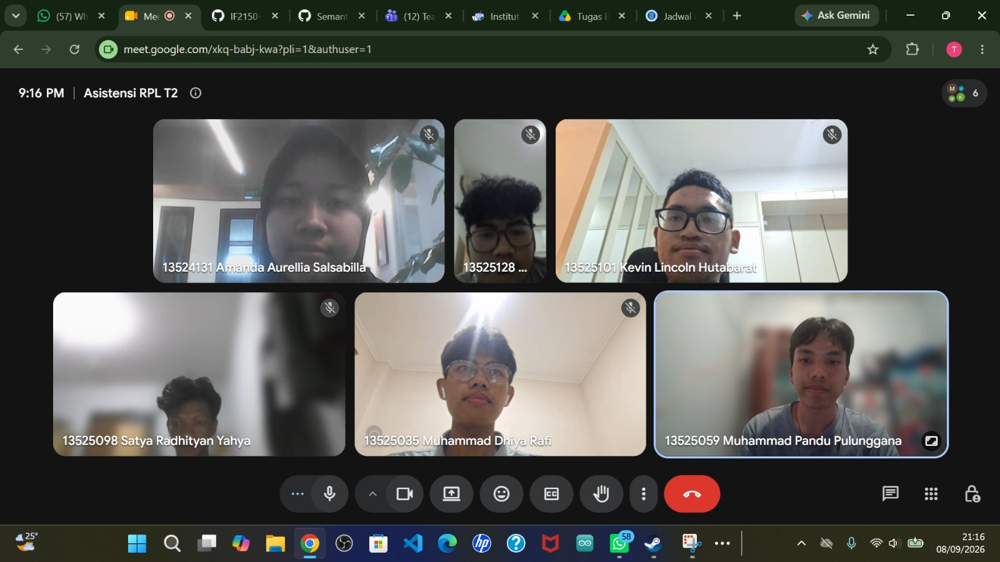

# Form Asistensi

## Tugas Besar IF2150 - Rekayasa Perangkat Lunak

| Informasi | Keterangan |
| --- | --- |
| **Hari** | *Selasa* |
| **Tanggal** | *08/09/2026* |
| **Kelas** | *K02* |
| **Nomor Kelompok** | *G03*  |
| **Nama Kelompok** | *LockedIn*  |
| **Nama Perangkat Lunak** | *Silembur*  |
| **Dokumen** | *K02_G03_RG*  |

### Anggota Kelompok

| NIM | Nama |
| --- | --- |
| *13525059* | *Muhammad Pandu Pulunggana* |
| *13525128* | *Mochamad Fachri Alfaridzi* |
| *13525101* | *Kevin Lincoln Hutabarat* |
| *13525035* | *Muhammad Dhiya Rafi* |
| *13525098* | *Satya Radhityan Yahya* |

### Catatan

| Catatan |
| --- |
| 1. Aktor-aktor yang ada di sistem rancangan perangkat lunak perlu untuk lebih dispesifikin lagi |
| 2. Untuk business requirement minimal ada 1 saja tidak apa, perlu dilihat lagi perangkat lunak yang dirancang termasuk dalam proses tersebut atau tidak |
| 3. Untuk kebutuhan fungsional dan non fungsional ikuti arahan dari dosen saja |
| 4. Jika ada perubahan dari milestone sebelumnya, jelaskan apa yang berubah di dalam tabel daftar perubahan |
| 5. Cek-cek kembali kesesuaian pemetaan kebutuhan dengan aktivitas|

## Dokumentasi

<!--  -->

  

  <i>Gambar 1. Dokumentasi kegiatan asistensi.</i>

