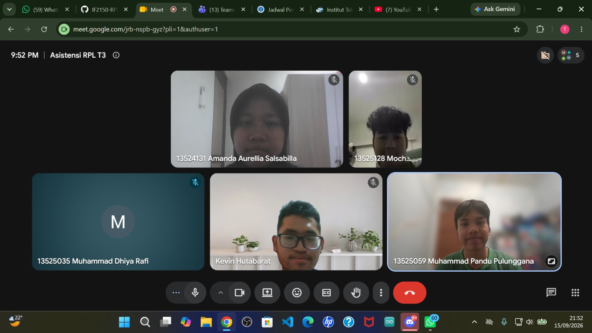

# Form Asistensi

## Tugas Besar IF2150 - Rekayasa Perangkat Lunak

| Informasi | Keterangan |
| --- | --- |
| **Hari** | *Selasa* |
| **Tanggal** | *15/09/2026* |
| **Kelas** | *K02* |
| **Nomor Kelompok** | *G03*  |
| **Nama Kelompok** | *LockedIn*  |
| **Nama Perangkat Lunak** | *Silembur*  |
| **Dokumen** | *K02_G03_RG*  |

### Anggota Kelompok

| NIM | Nama |
| --- | --- |
| *13525059* | *Muhammad Pandu Pulunggana* |
| *13525128* | *Mochamad Fachri Alfaridzi* |
| *13525101* | *Kevin Lincoln Hutabarat* |
| *13525035* | *Muhammad Dhiya Rafi* |
| *13525098* | *Satya Radhityan Yahya* |
### Catatan

| Catatan |
| --- |
| 1. Use case Di 3.2 sebaiknya spesifik untuk di bagian deskripsinya |
| 2. Sebaiknya penjelasan di use casenya memakai EARS seperti yang dijelaskan dan dicontohkan di kelas |
| 3. Menggabungkan KF-KF dari M2 yang mirip dan jangan lupa untuk perubahannya dimasukkan ke dalam tabel perubahan |
| 4. untuk diagram di 3.3 dibuat berdasarkan use case yang ada di 3.2 |

## Dokumentasi

<!--  -->

  

  <i>Gambar 1. Dokumentasi kegiatan asistensi.</i>

