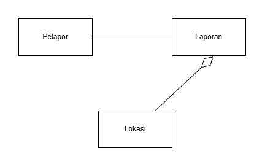
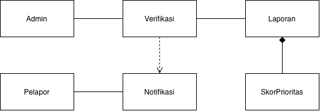
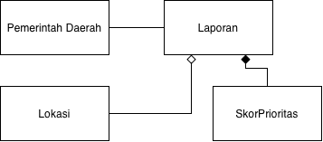
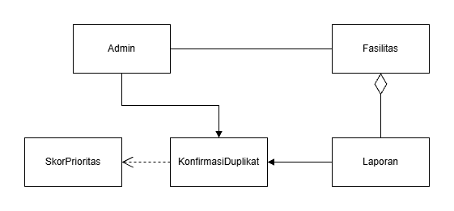
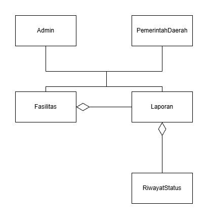
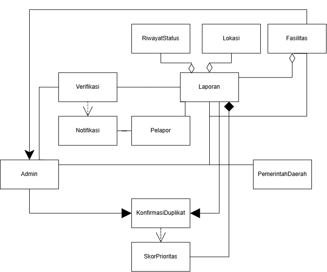

<h1>
IF2150 REKAYASA PERANGKAT LUNAK
 
TUGAS 4
 
CLASS DIAGRAM
</h1>
 

## *SILEMBUR*

### Untuk: *Amanda Aurellia Salsabila*

Dipersiapkan oleh:
| Informasi | Keterangan |
| --- | --- |
| Kelas | *K02* |
| Kelompok | *G03* |

| NIM | Nama |
| --- | --- |
| *13525059* | *Muhammad Pandu Pulunggana* |
| *13525128* | *Mochamad Fachri Alfaridzi* |
| *13525101* | *Kevin Lincoln Hutabarat* |
| *13525035* | *Muhammad Dhiya Rafi* |
| *13525098* | *Satya Radhityan Yahya* |
---

## Daftar Perubahan

| Revisi | Deskripsi |
| :--- | :--- |
| *A* | *Mengubah skenario UC 06 agar lebih sesuai dengan deskripsi usecase dan kebutuhan fungsional terkait* |
| *B* |  |
| *C* |  |
| ... |  |

 
 

# BAB 1: Deskripsi Perangkat Lunak

Tuliskan overview perangkat lunak dalam narasi yang dapat memberikan gambaran tentang konteks perangkat lunak aplikasi Anda.

Pada bagian ini, Anda diperbolehkan untuk menyalin dari dokumen sebelumnya.

Penerapan sistem aplikasi pelaporan ini menciptakan perbaikan fasilitas umum yang lebih terstruktur. Ketika masyarakat umum menemukan kerusakan di ruang publik, mereka dapat langsung melaporkannya pada waktu itu juga. Cukup dengan menambahkan detail yang diperlukan, laporan bisa dilanjutkan ke tahap verifikasi.

Pengguna dapat melakukan revisi pada laporannya apabila terdapat kesalahan pada detail laporan yang menyebabkan laporannya tidak terverifikasi oleh admin. Ketika laporan sudah terverifikasi dan dicek duplikat, laporan kemudian disimpan pada database. Dari database tersebut Pemerintah Daerah dapat merencanakan dan memulai perbaikan.

Setelah memberikan laporan, pengguna kemudian dapat memantau status laporannya untuk mengetahui proses pengerjaan. Selain itu, pengguna juga dapat melihat laporan kerusakan dari pengguna lain dan riwayat laporan yang sudah selesai diperbaiki.

---

# BAB 2: Kebutuhan Fungsional

## 2.1 Kebutuhan Fungsional

Salin ulang seluruh Kebutuhan Fungsional (KF) yang telah dirumuskan pada dokumen sebelumnya, lengkap dengan ID KF, ID Kebutuhan (mengacu ke ID pada tabel Pemetaan Kebutuhan di dokumen *Requirement Gathering*), dan penjelasannya.

Pada bagian ini, Anda diperbolehkan untuk menyalin dari dokumen sebelumnya.

 ***Catatan***: *Kebutuhan ditulis mengikuti pola EARS. Pada contoh di bawah, sebagian besar KF dipicu oleh satu aksi pelanggan, sehingga memakai pola event-driven "Ketika ⟨pemicu⟩, sistem harus ⟨respons⟩".*

Tabel 2.1. Daftar Kebutuhan Fungsional

| ID KF | ID Kebutuhan | Penjelasan |
| :--- | :--- | :--- |
| *KF01* | *R01* | *Sistem harus menampilkan formulir laporan dengan kolom foto, lokasi, dan deskripsi kerusakan fasilitas* |
| *KF02* | *R01* | *Ketika pengguna mengunggah foto, sistem harus menyimpan foto tersebut sebagai lampiran laporan* |
| *KF03* | *R01* | *Ketika layanan GPS tersedia, sistem harus mengambil data lokasi laporan secara otomatis. Ketika layanan GPS tidak tersedia, sistem harus menyediakan input lokasi manual melalui integrasi peta.* |
| *KF04* | *R02* | *Ketika pengguna mengirimkan formulir laporan, sistem harus menyimpan data laporan ke basis data dengan status awal menunggu verifikasi* |
| *KF05* | *R02* | *Sistem harus menyediakan pilihan keputusan verifikasi berupa setujui, tolak, atau minta revisi disertai kolom catatan alasan* |
| *KF06* | *R03* | *Sistem harus menampilkan daftar laporan berstatus menunggu verifikasi pada dashboard admin* |
| *KF07* | *R03* | *Ketika admin menetapkan keputusan verifikasi (setuju/tolak/revisi) beserta catatan alasan, sistem harus mengirimkan notifikasi hasil verifikasi beserta alasannya kepada pengguna* |
| *KF08* | *R04* | *Selama status laporan belum terverifikasi, sistem harus menahan laporan agar tidak diteruskan kepada pemerintah daerah* |
| *KF09* | *R05* | *Ketika admin menyelesaikan proses verifikasi laporan, sistem harus menyimpan status, catatan admin, dan waktu verifikasi ke basis data* |
| *KF10* | *R06* | *Sistem harus menampilkan daftar laporan pengguna lain tanpa menampilkan identitas pelapor* |
| *KF11* | *R06* | *Ketika pengguna memilih salah satu laporan dari daftar, sistem harus menampilkan detail lengkap laporan yaitu foto, lokasi, deskripsi, dan status, tanpa menampilkan identitas pelapor* |
| *KF12* | *R07* | *Ketika status laporan diperbarui, sistem harus memperbarui nilai status terkini pada laporan tersebut* |
| *KF13* | *R07* | *Sistem harus menampilkan status terbaru laporan kepada pengguna yang membuat laporan tersebut* |
| *KF14* | *R08* | *Ketika jumlah laporan kerusakan pada suatu fasilitas dalam satu periode melebihi ambang batas yang ditetapkan, sistem harus menandai fasilitas tersebut sebagai kandidat evaluasi perbaikan permanen pada dashboard admin dan pemerintah* |
| *KF15* | *R09* | *Ketika admin mengonfirmasi duplikat, sistem harus menggabungkan laporan-laporan tersebut menjadi satu laporan induk tanpa mengurangi jumlah pelapor yang tercatat* |
| *KF16* | *R10* | *Ketika laporan baru diverifikasi, sistem harus menghitung skor prioritas berdasarkan kategori kerusakan, jumlah pelapor, lama waktu menunggu penanganan, dan frekuensi laporan berulang* |
| *KF17* | *R10* | *Ketika data terkait laporan berubah, sistem harus memperbarui skor prioritas laporan tersebut* |
| *KF18* | *R11* | *Sistem harus menampilkan daftar laporan terverifikasi kepada pemerintah terurut berdasarkan skor prioritas* |
| *KF19* | *R11* | *Ketika pemerintah memilih filter kategori kerusakan dan/atau wilayah, sistem harus menyaring daftar laporan sesuai filter tersebut* |
| *KF20* | *R13* | *Ketika laporan baru masuk untuk fasilitas yang sudah memiliki laporan aktif, sistem harus memeriksa status aktif laporan lain pada fasilitas tersebut* |
| *KF21* | *R13* | *Ketika hasil pemeriksaan menemukan laporan aktif lain pada fasilitas yang sama, sistem harus menampilkan daftar kandidat laporan duplikat kepada admin untuk dikonfirmasi* |
| *KF22* | *R14* | *Ketika status laporan berubah, sistem harus mencatat perubahan tersebut sebagai riwayat yang terhubung dengan objek fasilitas terkait* |
| *KF23* | *R14* | *Sistem harus menampilkan riwayat perubahan status per fasilitas agar kerusakan berulang pada fasilitas yang sama dapat ditelusuri* |
| *KF24* | *R15* | *Sistem harus menampilkan status terkini dan riwayat penanganan laporan kepada pelapor yang membuat laporan tersebut* |

---

# BAB 3: Model Use Case

## 3.1 Identifikasi Aktor

Tuliskan kembali daftar aktor yang terlibat dan deskripsi perannya dalam perangkat lunak (P/L). Deskripsi peran harus menjelaskan wewenang aktor tersebut dalam perangkat lunak. Perlu diingat bahwa aktor yang dimaksud adalah pengguna yang berinteraksi langsung dengan P/L. Komponen seperti database, payment gateway, atau library bukan aktor.

Pada bagian ini, Anda diperbolehkan untuk menyalin dari dokumen sebelumnya.

| Aktor | Deskripsi |
| :--- | :--- |
| *Masyarakat umum* | *Pengguna ini bertindak sebagai pihak yang melaporkan dan melampirkan bukti fasilitas-fasilitas umum yang rusak kepada sistem. Karakteristik dari pengguna ini adalah mencari kemudahan dalam menggunakan aplikasi.* |
| *Admin* | *Pengguna ini bertindak sebagai verifikator bukti dan lokasi fasilitas-fasilitas umum yang rusak yang telah dilaporkan oleh pengguna dari pihak masyarakat umum. Karakteristik dari pengguna ini adalah mengutamakan kecepatan dan keakuratan dalam memverifikasi suatu laporan.* |
| *Pemerintah daerah* | *Pengguna ini bertindak sebagai pihak perencana dan pelaksana tindakan-tindakan yang harus dilakukan setelah menerima laporan fasilitas-fasilitas umum yang rusak. Karakteristik dari pengguna ini adalah mencari kemudahan dalam mendapatkan laporan.* |

## 3.2 Identifikasi Use Case

Use case berfungsi untuk mendeskripsikan interaksi aktor-aktor yang terlibat dengan sistem. Isi daftar use case dan deskripsi singkatnya dalam tabel di bawah.

Pada bagian ini, Anda diperbolehkan untuk menyalin dari dokumen sebelumnya.

| ID UC | Nama Use Case | Deskripsi Singkat | Aktor Terlibat | ID KF Terkait |
| :--- | :--- | :--- | :--- | :--- |
| *UC01* | *Membuat Laporan Kerusakan Fasilitas* | *Masyarakat umum mengisi formulir laporan kerusakan fasilitas dengan mengunggah foto, lokasi, dan deskripsi kerusakan, kemudian mengirimkannya untuk disimpan sistem.* | *Masyarakat umum* | *KF01, KF02, KF03, KF04, KF05* |
| *UC02* | *Memverifikasi Laporan dan Menghitung Prioritas* | *Admin meninjau daftar laporan pada dashboard, menyetujui/menolak/meminta revisi disertai catatan alasan, dan setelah laporan terverifikasi sistem menghitung skor prioritasnya.* | *Admin* | *KF06, KF07, KF08, KF09, KF16* |
| *UC03* | *Menyaring dan Memantau Laporan Terverifikasi Berdasarkan Prioritas* | *Pemerintah daerah melihat daftar laporan terverifikasi yang terurut berdasarkan skor prioritas, dan menyaring daftar tersebut berdasarkan kategori kerusakan maupun wilayah.* | *Pemerintah daerah* | *KF18, KF19* |
| *UC04* | *Melihat Daftar dan Detail Laporan Publik* | *Masyarakat umum melihat daftar laporan milik pengguna lain tanpa identitas pelapor, lalu memilih salah satu laporan untuk melihat detail lengkapnya.* | *Masyarakat umum* | *KF10, KF11* |
| *UC05* | *Memantau Status dan Riwayat Penanganan Laporan* | *Pelapor memantau status terkini laporan yang telah dibuat, termasuk melihat riwayat penanganan seiring pembaruan status oleh admin.* | *Masyarakat umum* | *KF12, KF13, KF24* |
| *UC06* | *Meninjau Fasilitas dengan Kerusakan Berulang* | *Admin dan pemerintah daerah meninjau fasilitas yang ditandai sebagai kandidat evaluasi perbaikan permanen karena laporan kerusakannya melebihi ambang batas dalam satu periode.* | *Admin, Pemerintah daerah* | *KF14* |
| *UC07* | *Mengonfirmasi dan Menggabungkan Laporan Duplikat* | *Admin memeriksa laporan aktif pada fasilitas yang sama, meninjau daftar kandidat duplikat, lalu mengonfirmasi penggabungan menjadi satu laporan induk sehingga skor prioritas diperbarui.* | *Admin* | *KF15, KF17, KF20, KF21* |
| *UC08* | *Melacak Riwayat Perubahan Status per Fasilitas* | *Admin dan pemerintah daerah menelusuri riwayat perubahan status laporan yang terhubung dengan fasilitas tertentu untuk memantau kerusakan berulang.* | *Admin, Pemerintah daerah* | *KF22, KF23* |

## 3.3 Use Case Diagram
Buatlah diagram use case keseluruhan berdasarkan identifikasi use case beserta aktor yang melakukan use case tersebut. Perhatikan garis `<<extend>>` dan `<<include>>`.

Pada bagian ini, Anda diperbolehkan untuk menyalin dari dokumen sebelumnya.

 

<i>Gambar 1. Use Case Diagram</i>

 

## 3.4 Skenario Use Case
Salin ulang skenario **setiap** use case (skenario normal dan alternatif) dari dokumen *Use Case & Scenario Use Case*. Skenario ini menjadi dasar penentuan atribut dan metode/operasi kelas pada BAB 4.

Pada bagian ini, Anda diperbolehkan untuk menyalin dari dokumen sebelumnya.

### 3.4.1 Skenario UC01

**Nama Use Case:** *Membuat Laporan Kerusakan Fasilitas*

**Skenario Normal**

| No | Aksi Aktor | Reaksi Perangkat Lunak |
| :--- | :--- | :--- |
| 1 | *Pengguna memilih menu laporan* | *Sistem menampilkan formulir yang akan diisi oleh pengguna, formulir mencakup foto, lokasi, dan deskripsi kerusakan beserta tombol Simpan Laporan agar pengguna dapat menyimpan laporan ke sistem (tombol masih terkunci)* |
| 2 | *Pengguna mengisi seluruh pertanyaan yang ada di formulir* | *Sistem membuka kunci tombol Simpan Laporan* |
| 3 | *Pengguna mengonfirmasi laporan yang telah dibuat* | *Sistem menyimpan laporan dan menampilkan informasi mengenai laporan tersebut* |

 

**Skenario Alternatif 1: Pengguna tidak mengisi seluruh formulir**

| No | Aksi Aktor | Reaksi Perangkat Lunak |
| :--- | :--- | :--- |
| 1 | *Pengguna memilih menu laporan* | *Sistem menampilkan formulir yang akan diisi oleh pengguna, formulir mencakup foto, lokasi, dan deskripsi kerusakan beserta tombol Simpan Laporan agar pengguna dapat menyimpan laporan ke sistem (tombol masih terkunci)* |
| 2 | *Pengguna tidak mengisi seluruh pertanyaan yang ada di formulir* | *Sistem masih mengunci tombol Simpan Laporan* |
| 3 | *Pengguna mengonfirmasi laporan yang telah dibuat* | *Sistem memberikan respons dan mengarahkan agar pengguna mengisi seluruh formulir* |
| 4 | *Pengguna mengisi formulir yang belum diisi* | *Sistem kembali ke langkah 2 skenario normal* |

### 3.4.2 Skenario UC02

**Nama Use Case:** *Memverifikasi Laporan dan Menghitung Prioritas*

**Skenario Normal**

| No | Aksi Aktor | Reaksi Perangkat Lunak |
| :--- | :--- | :--- |
| 1 | *Admin menerima laporan dari pengguna* | *Sistem memberikan notifikasi adanya laporan baru dari pengguna* |
| 2 | *Admin memverifikasi laporan yang diterima dan menghitung prioritas* | *Sistem menampilkan detail laporan, dan memberikan opsi untuk menyetujui atau menolak laporan* |
| 3 | *Admin menyetujui laporan yang diterima* | *Sistem menambahkan laporan baru kedalam database dengan prioritas yang diberikan* |

 

**Skenario Alternatif 1: Admin menolak laporan**

| No | Aksi Aktor | Reaksi Perangkat Lunak |
| :--- | :--- | :--- |
| 1 | *Admin menerima laporan dari pengguna* | *Sistem memberikan notifikasi adanya laporan baru dari pengguna* |
| 2 | *Admin memverifikasi laporan yang diterima dan menghitung prioritas* | *Sistem menampilkan detail laporan, dan memberikan opsi untuk menyetujui atau menolak laporan* |
| 3 | *Admin menolak laporan yang diterima* | *Sistem memberikan notifikasi kepada pengguna terkait laporannya yang membutuhkan revisi* |

### 3.4.3 Skenario UC03

**Nama Use Case:** *Menyaring dan Memantau Laporan Terverifikasi Berdasarkan Prioritas*

**Skenario Normal**

| No | Aksi Aktor | Reaksi Perangkat Lunak |
| :--- | :--- | :--- |
| 1 | *Pemerintah daerah memantau laporan yang sudah terverifikasi* | *Sistem menampilkan list laporan-laporan dari pengguna yang sudah terverifikasi dan diberikan prioritas oleh admin* |
| 2 | *Pemerintah daerah menyaring laporan yang sudah terverifikasi* | *Sistem dapat memberikan filter pada list laporan-laporan. Seperti filter prioritas, lokasi, kategori kerusakan, dll* |

### 3.4.4 Skenario UC04
**Nama Use Case:** *Melihat Daftar dan Detail Laporan Publik*

**Skenario Normal**
| No | Aksi Aktor | Reaksi Perangkat Lunak |
| :--- | :--- | :--- |
| 1 | *Masyarakat umum membuka menu Laporan Pengguna Lain* | *Sistem menampilkan list laporan yang sudah ditulis oleh pengguna lain yang mencakup  judul, foto, dan lokasi laporan* |
| 2 | *Masyarakat umum memilih laporan yang ingin dilihat* | *Sistem menampilkan laporan secara detail, yang mencakup judul, deksripsi, foto, dan status laporan* |

**Skenario Alternatif 1: Laporan dipilih menggunakan filter**
| No | Aksi Aktor | Reaksi Perangkat Lunak |
| :--- | :--- | :--- |
| 1 | *Masyarakat umum membuka menu Laporan Pengguna Lain* | *Sistem menampilkan list laporan yang sudah ditulis oleh pengguna lain yang mencakup  judul, foto, dan lokasi laporan* |
| 2 | *Masyarakat umum menerapkan filter lokasi* | *Sistem menampilkan list laporan pengguna lain yang terjadi di lokasi sesuai filter pengguna* |
| 3 | *Masyarakat umum memilih laporan yang ingin dilihat* | *Sistem menampilkan laporan secara detail, yang mencakup judul, deksripsi, foto, dan status laporan* |

**Skenario Alternatif 2: Tidak ada laporan yang muncul setelah menerapkan filter**
| No | Aksi Aktor | Reaksi Perangkat Lunak |
| :--- | :--- | :--- |
| 1 | *Masyarakat umum membuka menu Laporan Pengguna Lain* | *Sistem menampilkan list laporan yang sudah ditulis oleh pengguna lain yang mencakup  judul, foto, dan lokasi laporan* |
| 2 | *Masyarakat umum menerapkan filter lokasi, namun belum terdapat laporan* | *Sistem menampilkan pesan "belum ada laporan"* |

**Skenario Alternatif 3: Loading detail laporan terlalu lama**
| No | Aksi Aktor | Reaksi Perangkat Lunak |
| :--- | :--- | :--- |
| 1 | *Masyarakat umum membuka menu Laporan Pengguna Lain* | *Sistem menampilkan list laporan yang sudah ditulis oleh pengguna lain yang mencakup  judul, foto, dan lokasi laporan* |
| 2 | *Masyarakat umum memilih laporan yang ingin dilihat* | *Sistem berusaha memuat konten laporan, gagal memperlihatkan konten dalam 5 detik, dan menampilkan pesan "tolong muat ulang halaman"* |

### 3.4.5 Skenario UC05
**Nama Use Case:** *Memantau Status dan Riwayat Penanganan Laporan*

**Skenario Normal**
| No | Aksi Aktor | Reaksi Perangkat Lunak |
| :--- | :--- | :--- |
| 1 | *Masyarakat umum membuka menu Laporan yang telah dibuat* | *Sistem menampilkan list laporan yang sudah ditulis oleh pengguna yang mencakup  judul, foto, dan lokasi laporan* |
| 2 | *Masyarakat umum memilih laporan yang ingin dilihat* | *Sistem menampilkan laporan secara detail, yang mencakup judul, deksripsi, foto, status, dan riwayat pengerjaan laporan terurut dari terawal hingga terakhir* |

**Skenario Alternatif 1: Belum ada laporan yang dibuat**
| No | Aksi Aktor | Reaksi Perangkat Lunak |
| :--- | :--- | :--- |
| 1 | *Masyarakat umum membuka menu Laporan yang telah dibuat* | *Sistem menampilkan pesan "belum ada laporan"* |

**Skenario Alternatif 2: Loading detail laporan terlalu lama**
| No | Aksi Aktor | Reaksi Perangkat Lunak |
| :--- | :--- | :--- |
| 1 | *Masyarakat umum membuka menu Laporan yang telah dibuat* | *Sistem menampilkan list laporan yang sudah ditulis oleh pengguna lain yang mencakup  judul, foto, dan lokasi laporan* |
| 2 | *Masyarakat umum memilih laporan yang ingin dilihat* | *Sistem berusaha memuat konten laporan, gagal memperlihatkan konten dalam 5 detik, dan menampilkan pesan "tolong muat ulang halaman"* |

### 3.4.6 Skenario UC06
**Nama Use Case:** *Meninjau Fasilitas dengan Kerusakan Berulang*

**Skenario Normal**
| No | Aksi Aktor | Reaksi Perangkat Lunak |
| :--- | :--- | :--- |
| 1 | *Admin/Pemerintah daerah membuka dashboard aplikasi* | *Sistem menampilkan beberapa fasilitas-fasilitas yang mengalami kerusakan berulang beserta beberapa laporan-laporan yang dibuat pengguna* |
| 2 | *Admin/Pemerintah daerah memilih tombol "tampilkan lebih banyak" pada list fasilitas* | *Sistem mengarahkan pengguna ke laman yang hanya berisi list fasilitas-fasilitas yang mengalami kerusakan berulang beserta deskripsinya* |

**Skenario Alternatif 1: Tidak ada fasilitas yang muncul**
| No | Aksi Aktor | Reaksi Perangkat Lunak |
| :--- | :--- | :--- |
| 1 | *Admin/Pemerintah daerah membuka dashboard aplikasi* | *Sistem menampilkan pesan "belum ada fasilitas dengan kerusakan berulang" beserta beberapa laporan-laporan yang dibuat pengguna* |

**Skenario Alternatif 2: Loading dashboard terlalu lama**
| No | Aksi Aktor | Reaksi Perangkat Lunak |
| :--- | :--- | :--- |
| 1 | *Admin/Pemerintah daerah membuka dashboard aplikasi*| *Sistem berusaha memuat konten dashboard, gagal memperlihatkan konten dalam 5 detik, dan menampilkan pesan "tolong muat ulang halaman* |

### 3.4.7 Skenario UC07

**Nama Use Case:** *Mengonfirmasi dan Menggabungkan Laporan Duplikat*

**Skenario Normal**

| No | Aksi Aktor | Reaksi Perangkat Lunak |
| :--- | :--- | :--- |
| 1 | *Admin memilih menu daftar laporan aktif* | *Sistem menampilkan list laporan aktif* |
| 2 | *Admin mengaktifkan fitur untuk menggabungkan laporan duplikat* | *Sistem masih menampilkan list laporan aktif* |
| 3 | *Admin mencari dan menentukan laporan yang duplikat* | *Sistem menyimpan laporan-laporan yang telah ditandai oleh admin agar dipersiapkan untuk digabungkan* |
| 4 | *Admin mengonfirmasi pilihan* | *Sistem memberikan warning terlebih dahulu apakah admin yakin laporan-laporan yang dipilih merupakan laporan duplikat* |
| 5 | *Admin menekan tombol yakin dalam warning yang diberikan sistem* | *Sistem menggabungkan seluruh laporan yang telah ditandai dan sistem otomatis menghitung ulang skor* |

**Skenario Alternatif 1: Admin salah memilih laporan duplikat**

| No | Aksi Aktor | Reaksi Perangkat Lunak |
| :--- | :--- | :--- |
| 1 | *Admin memilih menu daftar laporan aktif* | *Sistem menampilkan list laporan aktif* |
| 2 | *Admin mengaktifkan fitur untuk menggabungkan laporan duplikat* | *Sistem masih menampilkan list laporan aktif* |
| 3 | *Admin mencari dan menentukan laporan yang duplikat* | *Sistem menyimpan laporan-laporan yang telah ditandai oleh admin agar dipersiapkan untuk digabungkan* |
| 4 | *Admin mengonfirmasi pilihan* | *Sistem memberikan warning terlebih dahulu apakah admin yakin laporan-laporan yang dipilih merupakan laporan duplikat* |
| 5 | *Admin menekan tombol tidak yakin dalam warning yang diberikan sistem* | *Sistem kembali lagi dan siap untuk mengubah laporan yang dipilih admin* |
| 6 | *Admin menghapus laporan yang ternyata tidak duplikat, lalu menambahkan laporan yang duplikat jika masih ada* | Sistem kembali ke langkah 3 skenario normal* |

### 3.4.8 Skenario UC08

**Nama Use Case:** *Melacak Riwayat Perubahan Status per Fasilitas*

**Skenario Normal**

| No | Aksi Aktor | Reaksi Perangkat Lunak |
| :--- | :--- | :--- |
| 1 | *Admin/Pemerintah daerah memilih menu riwayat perubahan laporan* | *Sistem menampilkan list laporan yang statusnya berubah* |
| 2 | *Admin/Pemerintah daerah mencari laporan terkait fasilitas tertentu di menu pencarian* | *Sistem menampilkan fasilitas yang dicari sesuai keyword dari Admin/Pemerintah daerah* |
| 3 | *Admin/Pemerintah daerah melihat lebih lanjut mengenai informasi perubahan* | *Sistem menampilkan detail mengenai kerusakan baru/berulang pada fasilitas tersebut* |

**Skenario Alternatif 1: Admin/Pemerintah daerah mencari fasilitas yang tidak ada dalam list laporan yang berubah**

| No | Aksi Aktor | Reaksi Perangkat Lunak |
| :--- | :--- | :--- |
| 1 | *Admin/Pemerintah daerah memilih menu riwayat perubahan laporan* | *Sistem menampilkan list laporan yang statusnya berubah* |
| 2 | *Admin/Pemerintah daerah mencari laporan terkait fasilitas tertentu yang tidak ada di dalam list laporan yang statusnya berubah di menu pencarian* | *Sistem memberikan peringatan bahwa laporan perubahan fasilitas yang dicari tidak ada di dalam sistem* |
| 3 | *Admin/Pemerintah daerah memasukkan kembali nama fasilitas yang ada di list laporan perubahan* | *Sistem kembali ke langkah 2 skenario normal* |

*Lanjutkan pola 3.4.x ini untuk setiap ID UC pada 3.2, sampai seluruh use case tercakup.*

---

# BAB 4: Diagram Kelas
Bagian ini berisi identifikasi kelas dan pemodelan struktur kelas yang diperlukan untuk merealisasikan use case pada BAB 3. Gunakan skenario use case (3.4) sebagai dasar untuk menentukan kelas, atribut, metode, dan hubungan antarkelas.

## 4.1 Identifikasi Kelas
Identifikasi seluruh kelas yang diperlukan berdasarkan use case dan skenarionya. Satu kelas boleh terkait dengan lebih dari satu use case.

| ID Kelas | Nama Kelas | Deskripsi Kelas | ID Use Case |
| :--- | :--- | :--- | :--- |
| *C01* | *Pelapor* | *Menyimpan identitas masyarakat umum, mengetahui laporan-laporan yang telah dibuatnya, dan memantau status penanganannya.* | *UC01, UC04, UC05* |
| *C02* | *Admin* | *Menyimpan identitas admin dan mengambil keputusan verifikasi serta konfirmasi duplikat atas laporan yang masuk.* | *UC02, UC06, UC07, UC08* |
| *C03* | *PemerintahDaerah* | *Menyimpan identitas pemerintah daerah dan menyaring/memantau laporan terverifikasi berdasarkan prioritas.* | *UC03, UC06, UC08* |
| *C04* | *Laporan* | *Mengetahui foto, lokasi, deskripsi, dan status kerusakan fasilitas; mencatat perubahan statusnya sendiri.* | *UC01, UC02, UC03, UC04, UC05, UC06, UC07, UC08* |
| *C05* | *Lokasi* | *Mengetahui koordinat laporan, memutuskan sumbernya dari GPS otomatis atau input peta manual.* | *UC01* |
| *C06* | *Fasilitas* | *Mengetahui seluruh laporan yang terjadi pada dirinya dan menandai dirinya sebagai kandidat evaluasi perbaikan permanen bila laporan melebihi ambang batas.* | *UC06, UC07, UC08* |
| *C07* | *Verifikasi* | *Mengetahui keputusan (setuju/tolak/revisi), catatan alasan, dan waktu verifikasi; memutuskan apakah laporan diteruskan ke pemerintah daerah.* | *UC02* |
| *C08* | *SkorPrioritas* | *Menghitung skor prioritas laporan berdasarkan kategori kerusakan, jumlah pelapor, lama waktu tunggu, dan frekuensi laporan berulang, serta memperbarui nilainya saat data terkait berubah.* | *UC02, UC03, UC07* |
| *C09* | *RiwayatStatus* | *Mencatat setiap perubahan status laporan yang terhubung dengan fasilitas terkait agar kerusakan berulang dapat ditelusuri.* | *UC05, UC08* |
| *C10* | *Notifikasi* | *Mengirimkan hasil verifikasi beserta alasannya kepada pelapor.* | *UC02* |
| *C11* | *KonfirmasiDuplikat* | *Mengetahui daftar kandidat laporan duplikat pada satu fasilitas dan melakukan penggabungan menjadi satu laporan induk.* | *UC07* |
| *...* | *...* | *...* | *...* |

Pastikan setiap kelas memiliki tanggung jawab yang jelas dan memang diperlukan untuk merealisasikan fungsi yang dimodelkan. Hindari kelas yang tidak memiliki keterkaitan dengan KF atau use case manapun.

## 4.2 Diagram Kelas per Use Case
Buat diagram kelas untuk setiap use case pada 3.2.

### 4.2.1 Use Case UC01

**Nama Use Case:** *Membuat Laporan Kerusakan Fasilitas*

#### Identifikasi Kelas

| ID Kelas | Nama Kelas | Deskripsi Kelas |
| :--- | :--- | :--- |
| *C01* | *Pelapor* | *Menyimpan identitas masyarakat umum, mengetahui laporan-laporan yang telah dibuatnya, dan memantau status penanganannya.* |
| *C04* | *Laporan* | *Mengetahui foto, lokasi, deskripsi, dan status kerusakan fasilitas; mencatat perubahan statusnya sendiri.* |
| *C05* | *Lokasi* | *Mengetahui koordinat laporan, memutuskan sumbernya dari GPS otomatis atau input peta manual.* | *UC01* |

#### Diagram Kelas

<i>Gambar 2. Diagram Kelas Use Case UC01</i>

 

Pada diagram kelas, cukup tampilkan nama kelas saja. Atribut dan metode/operasi milik setiap kelas dapat dituliskan pada tabel di bawah ini. Pastikan hubungan antarkelas menggunakan jenis relasi yang sesuai (asosiasi, agregasi, komposisi, generalisasi, atau dependensi).

| ID Kelas | Nama Kelas | Atribut | Metode/Operasi |
| :--- | :--- | :--- | :--- |
| *C01* | *Pelapor* | *idPelapor, namaPelapor* | *konfirmasiSimpanLaporan()* |
| *C04* | *Laporan* | *idLaporan, fotoLaporan, deskripsiLaporan, tanggalLaporan, statusLaporan* | *buatLaporanBaru(), tampilkanFormulir(), validasiIsianFormulir(), bukaKunciSimpan(), simpanLaporan()* |
| *C05* | *Lokasi* | *koordinat* | *setLokasiLaporan()* |

> Lanjutkan pola **4.2.x** untuk setiap use case pada 3.2.

### 4.2.2 Use Case UC02

**Nama Use Case:** *Memverifikasi Laporan dan Menghitung Prioritas*

#### Identifikasi Kelas

| ID Kelas | Nama Kelas | Deskripsi Kelas |
| :--- | :--- | :--- |
| *C01* | *Pelapor* | *Menyimpan identitas masyarakat umum, mengetahui laporan-laporan yang telah dibuatnya, dan memantau status penanganannya* |
| *C02* | *Admin* | *Menyimpan identitas admin dan mengambil keputusan verifikasi serta konfirmasi duplikat atas laporan yang masuk.* |
| *C04* | *Laporan* | *Mengetahui foto, lokasi, deskripsi, dan status kerusakan fasilitas* |
| *C07* | *Verifikasi* | *Mengetahui keputusan (setuju/tolak/revisi), catatan alasan, dan waktu verifikasi* |
| *C08* | *SkorPrioritas* | *Menghitung skor prioritas laporan berdasarkan kategori kerusakan, jumlah pelapor, lama waktu tunggu, dan frekuensi laporan berulang, serta memperbarui nilainya saat data terkait berubah.* |
| *C10* | *Notifikasi* | *Mengirimkan hasil verifikasi beserta alasannya kepada pelapor.* |

#### Diagram Kelas

<i>Gambar 3. Diagram Kelas Use Case UC02</i>

 

| ID Kelas | Nama Kelas | Atribut | Metode/Operasi |
| :--- | :--- | :--- | :--- |
| *C01* | *Pelapor* | *idPelapor, namaPelapor* | *terimaNotifikasi()* |
| *C02* | *Admin* | *idAdmin, namaAdmin* | *lihatDaftarLaporan(), tetapkanKeputusan(keputusan, catatan)* |
| *C04* | *Laporan* | *idLaporan, fotoLaporan, deskripsiLaporan, kategoriKerusakan, tanggalLaporan, statusLaporan* | *getLaporanMenungguVerifikasi(), getDetailLaporan(), updateStatus(status)* |
| *C07* | *Verifikasi* | *idVerifikasi, keputusan, catatanAlasan, waktuVerifikasi* | *simpanVerifikasi(), tahanLaporan(), teruskanKePemerintah()* |
| *C08* | *SkorPrioritas* | *jumlahPelapor, lamaMenunggu, frekuensiBerulang, skor* | *hitungSkor()* |
| *C10* | *Notifikasi* | *idNotifikasi, isiPesan, waktuKirim* | *kirimNotifikasi()* |

### 4.2.3 Use Case UC03

**Nama Use Case:** *Menyaring dan Memantau Laporan Terverifikasi Berdasarkan Prioritas*

#### Identifikasi Kelas

| ID Kelas | Nama Kelas | Deskripsi Kelas |
| :--- | :--- | :--- |
| *C03* | *PemerintahDaerah* | *Menyimpan identitas pemerintah daerah dan menyaring/memantau laporan terverifikasi berdasarkan prioritas.* |
| *C04* | *Laporan* | *Mengetahui foto, lokasi, deskripsi, dan status kerusakan fasilitas; mencatat perubahan statusnya sendiri.* |
| *C05* | *Lokasi* | *Mengetahui koordinat laporan, memutuskan sumbernya dari GPS otomatis atau input peta manual.* |
| *C08* | *SkorPrioritas* | *Menghitung skor prioritas laporan berdasarkan kategori kerusakan, jumlah pelapor, lama waktu tunggu, dan frekuensi laporan berulang, serta memperbarui nilainya saat data terkait berubah.* |

#### Diagram Kelas

<i>Gambar 4. Diagram Kelas Use Case UC03</i>

 

| ID Kelas | Nama Kelas | Atribut | Metode/Operasi |
| :--- | :--- | :--- | :--- |
| *C03* | *PemerintahDaerah* | *idPemerintah, namaInstansi, wilayahKerja* | *lihatLaporanTerverifikasi(), pilihFilter(kategori, wilayah)* |
| *C04* | *Laporan* | *idLaporan, fotoLaporan, deskripsiLaporan, kategoriKerusakan, tanggalLaporan, statusLaporan* | *getLaporanTerverifikasi(), urutkanBerdasarkanPrioritas(), filterLaporan(kategori, wilayah)* |
| *C05* | *Lokasi* | *koordinat, wilayah* | *getWilayah()* |
| *C08* | *SkorPrioritas* | *skor* | *getSkor()* |

### 4.2.4 Use Case UC04
**Nama Use Case:** *Melihat Daftar dan Detail Laporan Publik*

#### Identifikasi Kelas
| ID Kelas | Nama Kelas | Deskripsi Kelas |
| :--- | :--- | :--- |
| *C01* | *Pelapor* | *Menyimpan identitas masyarakat umum, mengetahui laporan-laporan yang telah dibuatnya, dan memantau status penanganannya* |
| *C04* | *Laporan* | *Mengetahui foto, lokasi, deskripsi, dan status kerusakan fasilitas* |

#### Diagram Kelas

<i>Gambar 5. Diagram Kelas Use Case UC04</i>

 

| ID Kelas | Nama Kelas | Atribut | Metode/Operasi |
| :--- | :--- | :--- | :--- |
| *C01* | *Pelapor* | *idPelapor, namaPelapor* | *bukaLaporan(Laporan)* |
| *C04* | *Laporan* | *idLaporan, fotoLaporan, deskripsiLaporan, tanggalLaporan, statusLaporan* | *getDetailLaporan()* |

### 4.2.5 Use Case UC05
**Nama Use Case:** *Memantau Status dan Riwayat Penanganan Laporan*

#### Identifikasi Kelas

| ID Kelas | Nama Kelas | Deskripsi Kelas |
| :--- | :--- | :--- |
| *C01* | *Pelapor* | *Menyimpan identitas masyarakat umum, mengetahui laporan-laporan yang telah dibuatnya, dan memantau status penanganannya* |
| *C04* | *Laporan* | *Mengetahui foto, lokasi, deskripsi, dan status kerusakan fasilitas; mencatat perubahan statusnya sendiri.* |
| *C09* | *RiwayatStatus* | *Mencatat setiap perubahan status laporan yang terhubung dengan fasilitas terkait agar kerusakan berulang dapat ditelusuri.* |

#### Diagram Kelas

<i>Gambar 6. Diagram Kelas Use Case UC05</i>

 

| ID Kelas | Nama Kelas | Atribut | Metode/Operasi |
| :--- | :--- | :--- | :--- |
| *C01* | *Pelapor* | *idPelapor, namaPelapor* | *bukaRiwayatLaporan(Laporan)* |
| *C04* | *Laporan* | *idLaporan, fotoLaporan, deskripsiLaporan, kategoriKerusakan, tanggalLaporan, statusLaporan* | *getRiwayatStatus()* |
| *C09* | *RiwayatStatus* | *idRiwayat, tanggalPerubahan, deskripsiPerubahan* | *getPerubahan()* |

### 4.2.6 Use Case UC06
**Nama Use Case:** *Meninjau Fasilitas dengan Kerusakan Berulang*

#### Identifikasi Kelas

| ID Kelas | Nama Kelas | Deskripsi Kelas |
| :--- | :--- | :--- |
| *C02* | *Admin* | *Menyimpan identitas admin dan mengambil keputusan verifikasi serta konfirmasi duplikat atas laporan yang masuk.* |
| *C03* | *PemerintahDaerah* | *Menyimpan identitas pemerintah daerah dan menyaring/memantau laporan terverifikasi berdasarkan prioritas.* |
| *C04* | *Laporan* | *Mengetahui foto, lokasi, deskripsi, dan status kerusakan fasilitas; mencatat perubahan statusnya sendiri.* |
| *C06* | *Fasilitas* | *Mengetahui seluruh laporan yang terjadi pada dirinya dan menandai dirinya sebagai kandidat evaluasi perbaikan permanen bila laporan melebihi ambang batas.* |

#### Diagram Kelas

<i>Gambar 7. Diagram Kelas Use Case UC06</i>

 

| ID Kelas | Nama Kelas | Atribut | Metode/Operasi |
| :--- | :--- | :--- | :--- |
| *C02* | *Admin* | *idAdmin, namaAdmin* | *lihatFasilitasRusakBerulang()* |
| *C03* | *PemerintahDaerah* | *idPemerintah, namaInstansi, wilayahKerja* | *lihatFasilitasRusakBerulang()* |
| *C04* | *Laporan* | *idLaporan, fotoLaporan, deskripsiLaporan, tanggalLaporan, statusLaporan* | *getDetailLaporan()* |
| *C06* | *Fasilitas* | *idFasilitas, namaFasilitas, lokasiFasilitas, jumlahLaporan* | *getDetailFasilitas()* |

### 4.2.7 Use Case UC07

**Nama Use Case:** *Mengonfirmasi dan Menggabungkan Laporan Duplikat*

#### Identifikasi Kelas

| ID Kelas | Nama Kelas | Deskripsi Kelas |
| :--- | :--- | :--- |
| *C02* | *Admin* | *Menyimpan identitas admin dan mengambil keputusan verifikasi serta konfirmasi duplikat atas laporan yang masuk.* |
| *C04* | *Laporan* | *Mengetahui foto, lokasi, deskripsi, dan status kerusakan fasilitas; mencatat perubahan statusnya sendiri.* |
| *C06* | *Fasilitas* | *Mengetahui seluruh laporan yang terjadi pada dirinya dan menandai dirinya sebagai kandidat evaluasi perbaikan permanen bila laporan melebihi ambang batas.* |
| *C08* | *SkorPrioritas* | *Menghitung skor prioritas laporan berdasarkan kategori kerusakan, jumlah pelapor, lama waktu tunggu, dan frekuensi laporan berulang, serta memperbarui nilainya saat data terkait berubah.* |
| *C11* | *KonfirmasiDuplikat* | *Mengetahui daftar kandidat laporan duplikat pada satu fasilitas dan melakukan penggabungan menjadi satu laporan induk.* |

#### Diagram Kelas

<i>Gambar 8. Diagram Kelas Use Case UC07</i>

 

| ID Kelas | Nama Kelas | Atribut | Metode/Operasi |
| :--- | :--- | :--- | :--- |
| *C02* | *Admin* | *idAdmin, namaAdmin* | *konfirmasiGabungLaporan()* |
| *C04* | *Laporan* | *idLaporan, fotoLaporan, deskripsiLaporan, tanggalLaporan, statusLaporan* | *pilihDuplikat()* |
| *C06* | *Fasilitas* | *idFasilitas, namaFasilitas* | *getLaporan(), cariFasilitas(keyword)* |
| *C08* | *SkorPrioritas* | *namaFasilitasInduk, skor* | *hitungSkor()* |
| *C11* | *KonfirmasiDuplikat* | *daftarKandidat, namaFasilitasInduk* | *simpanKandidat(), warning(), gabungLaporan()* |

### 4.2.8 Use Case UC08

**Nama Use Case:** *Melacak Riwayat Perubahan Status per Fasilitas*

#### Identifikasi Kelas

| ID Kelas | Nama Kelas | Deskripsi Kelas |
| :--- | :--- | :--- |
| *C02* | *Admin* | *Menyimpan identitas admin dan mengambil keputusan verifikasi serta konfirmasi duplikat atas laporan yang masuk.* |
| *C03* | *PemerintahDaerah* | *Menyimpan identitas pemerintah daerah dan menyaring/memantau laporan terverifikasi berdasarkan prioritas.* |
| *C04* | *Laporan* | *Mengetahui foto, lokasi, deskripsi, dan status kerusakan fasilitas; mencatat perubahan statusnya sendiri.* |
| *C06* | *Fasilitas* | *Mengetahui seluruh laporan yang terjadi pada dirinya dan menandai dirinya sebagai kandidat evaluasi perbaikan permanen bila laporan melebihi ambang batas.* |
| *C09* | *RiwayatStatus* | *Mencatat setiap perubahan status laporan yang terhubung dengan fasilitas terkait agar kerusakan berulang dapat ditelusuri.* |

#### Diagram Kelas

<i>Gambar 9. Diagram Kelas Use Case UC08</i>

 

| ID Kelas | Nama Kelas | Atribut | Metode/Operasi |
| :--- | :--- | :--- | :--- |
| *C04* | *Laporan* | *idLaporan, fotoLaporan, deskripsiLaporan, tanggalLaporan, statusLaporan* | *getRiwayatStatus()* |
| *C06* | *Fasilitas* | *idFasilitas, namaFasilitas* | *getLaporan(), cariFasilitas(keyword)* |
| *C09* | *RiwayatStatus* | *idRiwayat, tanggalPerubahan, deskripsiPerubahan* | *getPerubahan()* |

## 4.3 Diagram Kelas Keseluruhan

<i>Gambar 10. Diagram Kelas Keseluruhan</i>

 

| ID Kelas | Nama Kelas | Atribut | Metode/Operasi |
| :--- | :--- | :--- | :--- |
| *C01* | *Pelapor* | *idPelapor, namaPelapor* | *konfirmasiSimpanLaporan(), terimaNotifikasi()* |
| *C02* | *Admin* | *idAdmin, namaAdmin* | *lihatDaftarLaporan(), tetapkanKeputusan(keputusan,catatan), konfirmasiGabungLaporan()* |
| *C03* | *PemerintahDaerah* | *idPemerintah, namaInstansi, wilayahKerja* | *lihatLaporanTerverifikasi(), pilihFilter(kategori, wilayah)* |
| *C04* | *Laporan* | *idLaporan, fotoLaporan, deskripsiLaporan, kategoriKerusakan(), tanggalLaporan, statusLaporan* | *buatLaporanBaru(), tampilkanFormulir(), validasiIsianFormulir(), bukaKunciSimpan(), simpanLaporan(), getLaporanMenungguVerifikasi(), getDetailLaporan(), updateStatus(status), getLaporanTerverifikasi(), urutkanBerdasarkanPrioritas(), filterLaporan(kategori, wilayah), pilihDuplikat()* |
| *C05* | *Lokasi* | *koordinat, wilayah* | *setLokasiLaporan(), getWilayah()* |
| *C06* | *Fasilitas* | *idFasilitas, namaFasilitas* | *getLaporan(), cariFasilitas(keyword)* |
| *C07* | *Verifikasi* | *idVerifikasi, keputusan, catatanAlasan, waktuVerifikasi* | *simpanVerifikasi(), tahanLaporan(), teruskanKePemerintah()* |
| *C08* | *SkorPrioritas* | *jumlahPelapor, lamaMenunggu, frekuensiBerulang, namaFasilitasInduk, skor* | *hitungSkor(), getSkor()* |
| *C09* | *RiwayatStatus* | *idRiwayat, tanggalPerubahan, deskripsiPerubahan* | *getPerubahan()* |
| *C10* | *Notifikasi* | *idNotifikasi, isiPesan, waktuKirim* | *kirimNotifikasi()* |
| *C11* | *KonfirmasiDuplikat* | *daftarKandidat, namaFasilitasInduk* | *simpanKandidat(), warning(), gabungLaporan()* |

---

# BAB 5: Traceability
Cocokkan setiap kebutuhan fungsional, use case, dengan diagram kelas yang mendukung atau mengimplementasikan kebutuhan tersebut.

| ID Kelas | ID Use Case | ID KF |
| :--- | :--- | :--- |
| *C01* | *UC01, UC04, UC05* | *KF01, KF02, KF03, KF04, KF05, KF10, KF11, KF12, KF13, KF24* |
| *C02* | *UC02, UC06, UC07, UC08* | *KF06, KF07, KF08, KF09, KF14, KF15, KF16, KF17, KF20, KF21, KF22, KF23* |
| *C03* | *UC03, UC06, UC08* | *KF14, KF18, KF19, KF22, KF23* |
| *C04* | *UC01, UC02, UC03, UC04, UC05, UC06, UC07, UC08* | *KF01, KF02, KF03, KF04, KF05, KF06, KF07, KF08, KF09, KF10, KF11, KF12, KF13, KF14, KF15, KF16, KF17, KF18, KF19, KF20, KF21, KF22, KF23, KF24* |
| *C05* | *UC01* | *KF01, KF02, KF03, KF04, KF05* |
| *C06* | *UC06, UC07, UC08* | *KF14, KF15, KF17, KF20, KF21, KF22, KF23* |
| *C07* | *UC02* | *KF06, KF07, KF08, KF09, KF16* |
| *C08* | *UC02, UC03, UC07* | *KF06, KF07, KF08, KF09, KF15, KF16, KF17, KF18, KF19, KF20, KF21* |
| *C09* | *UC05, UC08* | *KF12, KF13, KF22, KF23, KF24* |
| *C10* | *UC02* | *KF06, KF07, KF08, KF09, KF16* |
| *C11* | *UC07* | *KF15, KF17, KF20, KF21* |

---

# Referensi

- Diagram UML: [https://www.drawio.com/](https://www.drawio.com/), [https://staruml.io/](https://staruml.io/)
