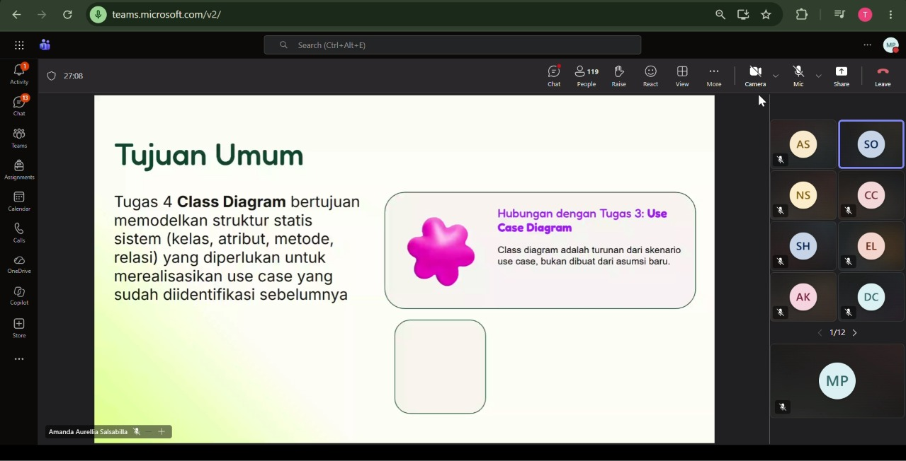

# Form Asistensi

## Tugas Besar IF2150 - Rekayasa Perangkat Lunak

| Informasi | Keterangan |
| --- | --- |
| **Hari** | *Jumat* |
| **Tanggal** | *18/09/2026* |
| **Kelas** | *K02* |
| **Nomor Kelompok** | *G03*  |
| **Nama Kelompok** | *LockedIn*  |
| **Nama Perangkat Lunak** | *Silembur*  |
| **Dokumen** | *K02_G03_RG*  |

### Anggota Kelompok

| NIM | Nama |
| --- | --- |
| *13525059* | *Muhammad Pandu Pulunggana* |
| *13525128* | *Mochamad Fachri Alfaridzi* |
| *13525101* | *Kevin Lincoln Hutabarat* |
| *13525035* | *Muhammad Dhiya Rafi* |
| *13525098* | *Satya Radhityan Yahya* |

### Catatan

| Catatan |
| --- |
| 1. Untuk pembuatan diagram kelas, buatlah diagram per use case terlebih dahulu baru digabung nanti dan dirapihkan agar tidak ada yang berpotongan |
| 2. Notasi-notasi pada digram kelas yakni asosiasi, agregasi, komposisi, generalisasi, dependensi, dan realisasi |
| 3. Ada beberapa tools yang dapat digunakan untuk membuat diagram kelas. Meskipun bisa menggunakan AI, lebih baik usahakan membuat secara mandiri terlebih dahulu |
| 4. Boundary class adalah class yang berhubungan dengan client |
| 5. Controller class adalah class menghubungkan booundary dengan entity |
| 6. Entity class adalah class yang menyimpan dan memanipulasi data |

## Dokumentasi

<!--  -->

  

  <i>Gambar 1. Dokumentasi kegiatan asistensi.</i>

