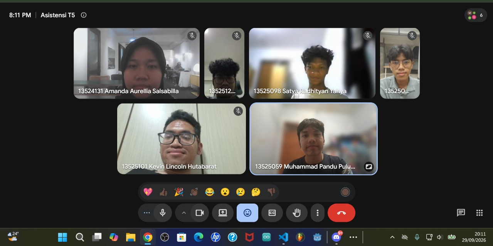

# Form Asistensi

## Tugas Besar IF2150 - Rekayasa Perangkat Lunak

| Informasi | Keterangan |
| --- | --- |
| **Hari** | *Selasa* |
| **Tanggal** | *29/09/2026* |
| **Kelas** | *K02* |
| **Nomor Kelompok** | *G03*  |
| **Nama Kelompok** | *LockedIn*  |
| **Nama Perangkat Lunak** | *Silembur*  |
| **Dokumen** | *K02_G03_RG*  |

### Anggota Kelompok

| NIM | Nama |
| --- | --- |
| *13525059* | *Muhammad Pandu Pulunggana* |
| *13525128* | *Mochamad Fachri Alfaridzi* |
| *13525101* | *Kevin Lincoln Hutabarat* |
| *13525035* | *Muhammad Dhiya Rafi* |
| *13525098* | *Satya Radhityan Yahya* |

### Catatan

| Catatan |
| --- |
| 1. Penjelasan-penjelasan yang sudah dibuat di milestone sebelumnya dibikin satu dua paragraf saja tapi bisa mencakup seluruhnya |
| 2. Penjelasan yang template di simpan jika masih relevan dengan isi yang diinginkan. dihapus saja jika terlalu terlihat template |
| 3. Untuk 1.6 dibuat penjelasannya dengan bentuk paragraf, tidak perlu dengan tabel atau juga tidak perlu seperti daftar isi |
| 4. Setelah milestone 5 ini masih belum implementasinya, masih ada perencanaan lagi seperti arsitektur dan deskripsi perancangan perangkat lunak |
| 5. Sebaiknya SKPL tidak diubah terlalu banyak setelah milestone ini, SKPL akan berfungsi sebagai dokumen panduan untuk kedepannya |

## Dokumentasi

<!--  -->

  

  <i>Gambar 1. Dokumentasi kegiatan asistensi.</i>

