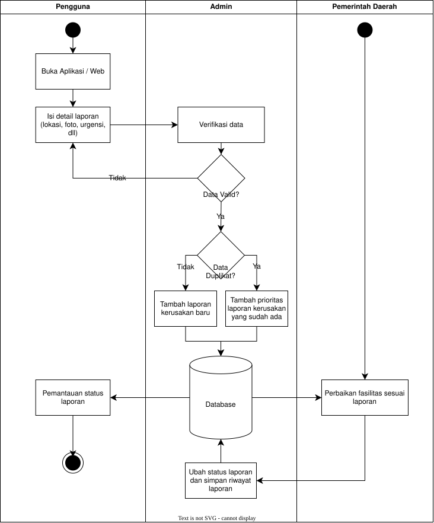
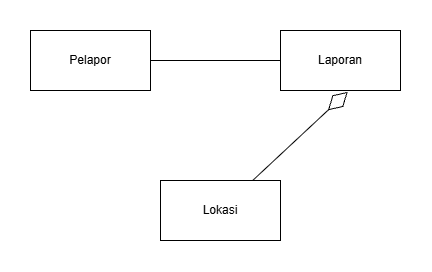
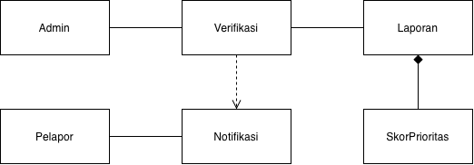
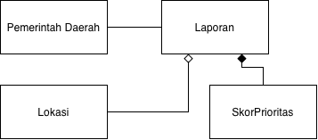
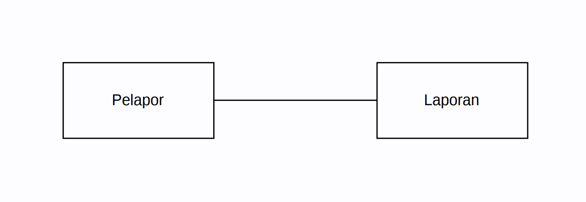
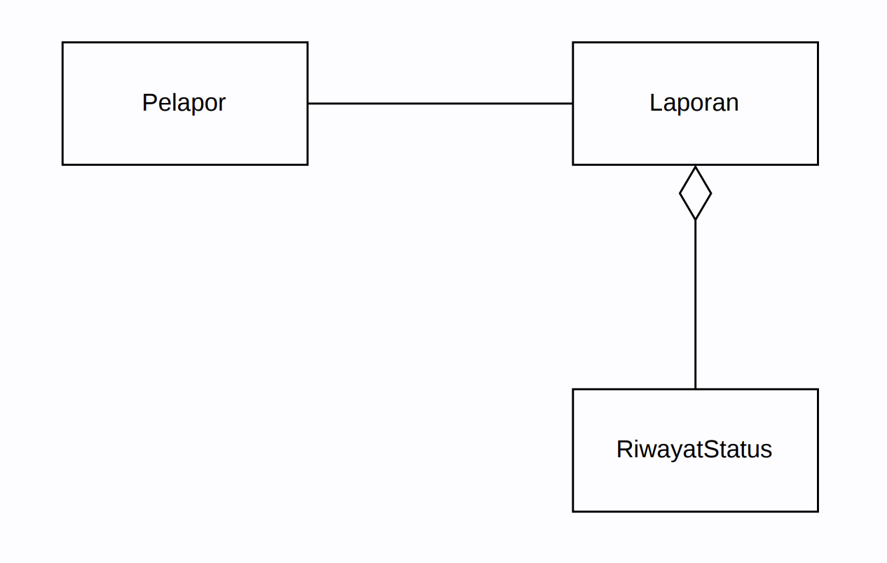
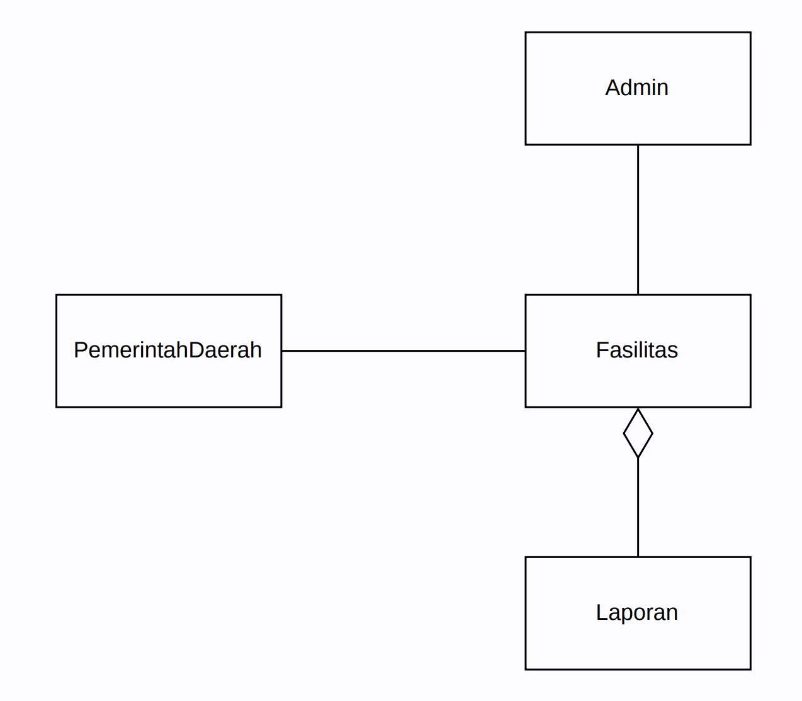
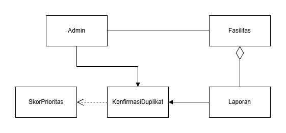
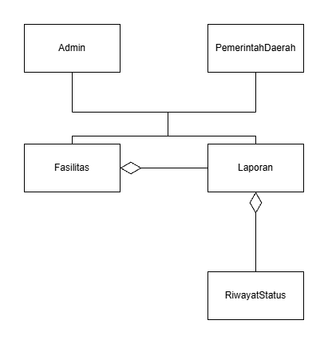
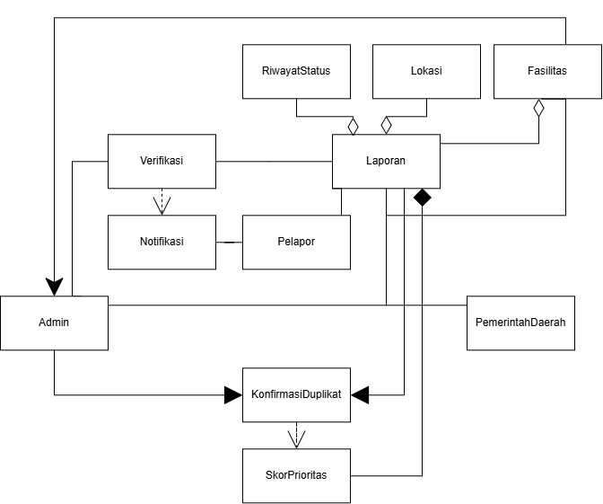

<h1>
IF2150 REKAYASA PERANGKAT LUNAK
 
TUGAS 5
 
SPESIFIKASI KEBUTUHAN PERANGKAT LUNAK (SKPL)
</h1>
 

## *SILEMBUR*

### Untuk: *Amanda Aurellia Salsabila*

Dipersiapkan oleh:
| Informasi | Keterangan |
| --- | --- |
| Kelas | *K02* |
| Kelompok | *G03* |

| NIM | Nama |
| --- | --- |
| *13525059* | *Muhammad Pandu Pulunggana* |
| *13525128* | *Mochamad Fachri Alfaridzi* |
| *13525101* | *Kevin Lincoln Hutabarat* |
| *13525035* | *Muhammad Dhiya Rafi* |
| *13525098* | *Satya Radhityan Yahya* |
---

## Daftar Perubahan

| Revisi | Deskripsi |
| :--- | :--- |
| *A* | *Deskripsikan perubahan yang dilakukan dari dokumen sebelumnya pada dokumen ini. Jika tidak terdapat perubahan, harap kosongkan tabel.* |
| *B* |  |
| *C* |  |
| ... |  |

 

# BAB 1: Pendahuluan

## 1.1 Tujuan Penulisan Dokumen
Dokumen SKPL ini mendefinisikan kebutuhan perangkat lunak SILEMBUR yaitu kebutuhan fungsional, kebutuhan non fungsional, dan pemodelan use case. Isinya adalah versi final dari dokumen Topic Brainstorming, Requirement Gathering, Use Case, dan Class Diagram yang telah disusun sebelumnya. Dokumen ini digunakan oleh Kelompok G03 sebagai acuan saat merancang, mengimplementasikan, dan menguji P/L. Asisten mata kuliah IF2150 menggunakannya untuk memeriksa kesesuaian kebutuhan dengan hasil akhir.

## 1.2 Lingkup Masalah
SILEMBUR (Sistem Informasi Lembur) adalah aplikasi web mobile untuk melaporkan kerusakan fasilitas umum seperti jalan berlubang, lampu penerangan jalan yang mati, dan pohon tumbang. Nama "lembur" diambil dari bahasa Sunda yang berarti kampung. Masyarakat membuat laporan berisi foto, lokasi GPS, dan deskripsi kerusakan. Admin kemudian memverifikasi laporan tersebut sebelum diteruskan ke pemerintah daerah. Kanal pengaduan yang ada saat ini, seperti SP4N-LAPOR dan JAKI, memperlakukan setiap laporan sebagai pengaduan terpisah. Akibatnya laporan duplikat menumpuk, prioritas penanganan tidak langsung terlihat, dan riwayat kerusakan suatu fasilitas sulit ditelusuri. SILEMBUR menangani masalah tersebut dengan menggabungkan laporan duplikat, menghitung skor prioritas setiap laporan terverifikasi, dan mencatat riwayat status per fasilitas. Cakupan sistem dibatasi pada satu kota dengan tiga jenis pengguna, yaitu masyarakat umum, admin, dan pemerintah daerah.

## 1.3 Definisi, Istilah, dan Singkatan
Semua definisi dan singkatan yang digunakan dalam dokumen ini beserta penjelasannya.

Tabel 1.3. Definisi Istilah dan Singkatan

| Singkatan, Akronim, atau Istilah | Penjelasan |
| :--- | :--- |
| *P/L* | *Singkatan dari Perangkat Lunak, yaitu aplikasi yang memberikan perintah kepada komputer untuk menjalankan tugas tertentu.* |
| *SKPL* | *Singkatan dari Spesifikasi Kebutuhan Perangkat Lunak, yaitu dokumen yang merangkum kriteria-kriteria yang diperlukan untuk membangun aplikasi menjalankan tugasnya.* |
| *KF* | *Singkatan dari Kebutuhan Fungsional.* |
| *KNF* | *Singkatan dari Kebutuhan Non-Fungsional.* |
| *UC* | *Singkatan dari Use Case.* |
| *EARS* | *Easy Approach to Requirements Syntax, yaitu pola penulisan kebutuhan agar konsisten dan mudah diuji.* |
| *...* | *...* |

## 1.4 Aturan Penomoran
Tuliskan aturan penomoran (ID) yang digunakan dalam dokumen ini. Gunakan pola ID yang **sama** dengan yang sudah dipakai pada dokumen-dokumen sebelumnya, jangan membuat pola baru di dokumen ini.

Tabel 1.4. Aturan Penomoran

| Hal/Bagian | Penomoran | Keterangan |
| :--- | :--- | :--- |
| *Kebutuhan Fungsional* | *KFXX* | |
| *Kebutuhan Non-Fungsional* | *KNFXX* | |
| *Aktor* | *AXX* | |
| *Use Case* | *UCXX* | |
| *Kelas* | *CXX* | |
| *...* | *...* |

## 1.5 Referensi
Dokumentasi P/L yang dirujuk oleh dokumen ini. Referensi dapat berupa buku, panduan, ataupun dokumentasi lain yang dipakai dalam pengembangan P/L ini.

## 1.6 Deskripsi Umum Dokumen (Ikhtisar)
Dokumen SKPL SILEMBUR ini terdiri dari enam bab. BAB 1 berisi pendahuluan dokumen. BAB 2 membahas deskripsi umum perangkat lunak. BAB 3 memuat kebutuhan fungsional dan non-fungsional. BAB 4 membahas pemodelan use case beserta skenarionya. BAB 5 membahas pemodelan kelas. BAB 6 menyajikan traceability yang menghubungkan kebutuhan, use case, dan kelas.

---

# BAB 2: Deskripsi Perangkat Lunak

## 2.1 Deskripsi Umum Sistem
Penerapan sistem aplikasi pelaporan ini menciptakan perbaikan fasilitas umum yang lebih terstruktur. Ketika masyarakat umum menemukan kerusakan di ruang publik, mereka dapat langsung melaporkannya pada waktu itu juga. Cukup dengan menambahkan detail yang diperlukan, laporan bisa dilanjutkan ke tahap verifikasi.

Pengguna dapat melakukan revisi pada laporannya apabila terdapat kesalahan pada detail laporan yang menyebabkan laporannya tidak terverifikasi oleh admin. Ketika laporan sudah terverifikasi dan dicek duplikat, laporan kemudian disimpan pada database. Dari database tersebut Pemerintah Daerah dapat merencanakan dan memulai perbaikan.

Setelah memberikan laporan, pengguna kemudian dapat memantau status laporannya untuk mengetahui proses pengerjaan. Selain itu, pengguna juga dapat melihat laporan kerusakan dari pengguna lain dan riwayat laporan yang sudah selesai diperbaiki.

<i>Gambar 1. Activity Diagram</i>

## 2.2 Deskripsi Umum Perangkat Lunak
Silembur merupakan sistem aplikasi pelaporan untuk fasilitas umum yang mengalami kerusakan. Laporan dapat dibuat oleh masyarakat umum, pengguna cukup mencantumkan detail yang diperlukan melalui antarmuka aplikasi lalu menyimpan laporan tersebut. Setelah itu, admin akan memverifikasi apakah laporan tersebut valid atau tidak valid. Laporan yang sudah valid akan disimpan di database yang dapat Pemerintah Daerah akses untuk melakukan penanganan lebih lanjut. Proses perbaikan fasilitas akan diperbaharui secara berkala melalui aplikasi sehingga pengguna juga dapat memantau perkembangan dari perbaikan yang dilakukan.

## 2.3 Pengguna dan Kebutuhan Pengguna Perangkat Lunak
Tuliskan seluruh jenis pengguna (*role*/aktor) yang terlibat dalam perangkat lunak (P/L), beserta kebutuhannya secara umum. Bagian ini dapat disalin dari 1.2 *Deskripsi Pengguna Perangkat Lunak* (dokumen Requirement Gathering) atau 3.1 *Identifikasi Aktor* (dokumen Use Case), pastikan sudah konsisten dengan aktor final yang dipakai di BAB 4.

| Pengguna | Kebutuhan |
| :--- | :--- |
| *Pelanggan* | *Pelanggan harus dapat memesan produk, mengelola keranjang, dan menyelesaikan pembayaran melalui sistem.* |
| *...* | *...* |

## 2.4 Batasan Perangkat Lunak
Batasan yang harus dituliskan, di antaranya:
1. *P/L harus memakai file data/API dari sistem lain (sebutkan, misal Payment Gateway dummy).*
2. *P/L harus memakai format data yang sama dengan sistem lain.*
3. *P/L harus berfungsi pada platform tertentu (misal: web browser modern, atau desktop Windows dan Linux).*
4. *...*

## 2.5 Lingkungan Operasi Perangkat Lunak
Spesifikasi *operating system* atau lingkungan yang dibutuhkan P/L untuk beroperasi. Bagian ini digunakan untuk memastikan pengguna memiliki spesifikasi yang cukup untuk menjalankan P/L. Misalnya mencakup komponen server, client, OS, DBMS, tetapi tidak menutupi kemungkinan komponen lain.

| Komponen | Spesifikasi |
| :--- | :--- |
| *Server* | *[contoh: Node.js v20, dijalankan pada layanan cloud]* |
| *Client* | *[contoh: Web Browser modern (Chrome, Firefox terbaru)]* |
| *DBMS* | *[contoh: PostgreSQL 15]* |
| *OS* | *[contoh: Cross-platform (Windows/Linux/MacOS) melalui browser]* |
| *...* | *...* |

---

# BAB 3: Deskripsi Kebutuhan Perangkat Lunak

## 3.1 Kebutuhan Fungsional (KF)
Salin ulang **seluruh Kebutuhan Fungsional (KF)** versi terbaru dari BAB 2.1 dokumen *Class Diagram* (sudah versi final dan sudah memakai format EARS). Pastikan ID Kebutuhan (kolom "ID Kebutuhan") juga konsisten dengan ID pada tabel Pemetaan Kebutuhan di dokumen *Requirement Gathering*.

Tabel 3.1. Kebutuhan Fungsional

| ID KF | ID Kebutuhan | Penjelasan |
| :--- | :--- | :--- |
| *KF01* | *R01* | *Sistem harus menampilkan formulir laporan dengan kolom foto, lokasi, dan deskripsi kerusakan fasilitas* |
| *KF02* | *R01* | *Ketika pengguna mengunggah foto, sistem harus menyimpan foto tersebut sebagai lampiran laporan* |
| *KF03* | *R01* | *Ketika layanan GPS tersedia, sistem harus mengambil data lokasi laporan secara otomatis. Ketika layanan GPS tidak tersedia, sistem harus menyediakan input lokasi manual melalui integrasi peta.* |
| *KF04* | *R02* | *Ketika pengguna mengirimkan formulir laporan, sistem harus menyimpan data laporan ke basis data dengan status awal menunggu verifikasi* |
| *KF05* | *R02* | *Sistem harus menyediakan pilihan keputusan verifikasi berupa setujui, tolak, atau minta revisi disertai kolom catatan alasan* |
| *KF06* | *R03* | *Sistem harus menampilkan daftar laporan berstatus menunggu verifikasi pada dashboard admin* |
| *KF07* | *R03* | *Ketika admin menetapkan keputusan verifikasi (setuju/tolak/revisi) beserta catatan alasan, sistem harus mengirimkan notifikasi hasil verifikasi beserta alasannya kepada pengguna* |
| *KF08* | *R04* | *Selama status laporan belum terverifikasi, sistem harus menahan laporan agar tidak diteruskan kepada pemerintah daerah* |
| *KF09* | *R05* | *Ketika admin menyelesaikan proses verifikasi laporan, sistem harus menyimpan status, catatan admin, dan waktu verifikasi ke basis data* |
| *KF10* | *R06* | *Sistem harus menampilkan daftar laporan pengguna lain tanpa menampilkan identitas pelapor* |
| *KF11* | *R06* | *Ketika pengguna memilih salah satu laporan dari daftar, sistem harus menampilkan detail lengkap laporan yaitu foto, lokasi, deskripsi, dan status, tanpa menampilkan identitas pelapor* |
| *KF12* | *R07* | *Ketika status laporan diperbarui, sistem harus memperbarui nilai status terkini pada laporan tersebut* |
| *KF13* | *R07* | *Sistem harus menampilkan status terbaru laporan kepada pengguna yang membuat laporan tersebut* |
| *KF14* | *R08* | *Ketika jumlah laporan kerusakan pada suatu fasilitas dalam satu periode melebihi ambang batas yang ditetapkan, sistem harus menandai fasilitas tersebut sebagai kandidat evaluasi perbaikan permanen pada dashboard admin dan pemerintah* |
| *KF15* | *R09* | *Ketika admin mengonfirmasi duplikat, sistem harus menggabungkan laporan-laporan tersebut menjadi satu laporan induk tanpa mengurangi jumlah pelapor yang tercatat* |
| *KF16* | *R10* | *Ketika laporan baru diverifikasi, sistem harus menghitung skor prioritas berdasarkan kategori kerusakan, jumlah pelapor, lama waktu menunggu penanganan, dan frekuensi laporan berulang* |
| *KF17* | *R10* | *Ketika data terkait laporan berubah, sistem harus memperbarui skor prioritas laporan tersebut* |
| *KF18* | *R11* | *Sistem harus menampilkan daftar laporan terverifikasi kepada pemerintah terurut berdasarkan skor prioritas* |
| *KF19* | *R11* | *Ketika pemerintah memilih filter kategori kerusakan dan/atau wilayah, sistem harus menyaring daftar laporan sesuai filter tersebut* |
| *KF20* | *R13* | *Ketika laporan baru masuk untuk fasilitas yang sudah memiliki laporan aktif, sistem harus memeriksa status aktif laporan lain pada fasilitas tersebut* |
| *KF21* | *R13* | *Ketika hasil pemeriksaan menemukan laporan aktif lain pada fasilitas yang sama, sistem harus menampilkan daftar kandidat laporan duplikat kepada admin untuk dikonfirmasi* |
| *KF22* | *R14* | *Ketika status laporan berubah, sistem harus mencatat perubahan tersebut sebagai riwayat yang terhubung dengan objek fasilitas terkait* |
| *KF23* | *R14* | *Sistem harus menampilkan riwayat perubahan status per fasilitas agar kerusakan berulang pada fasilitas yang sama dapat ditelusuri* |
| *KF24* | *R15* | *Sistem harus menampilkan status terkini dan riwayat penanganan laporan kepada pelapor yang membuat laporan tersebut* |

## 3.2 Kebutuhan Non-Fungsional (KNF)
Salin ulang Kebutuhan Non-Fungsional dari BAB 2.5 dokumen *Requirement Gathering*, sesuaikan ID Kebutuhan (kolom "ID Kebutuhan") apabila terjadi perubahan penomoran pada BAB 3.1 di atas.

Tabel 3.2. Kebutuhan Non-Fungsional

| ID KNF | ID Kebutuhan | Parameter | Deskripsi Kebutuhan |
| :--- | :--- | :--- | :--- |
| *KNF01* | *R02* | *Availability* | *Sistem dapat diakses kapanpun dan dimanapun selama 24 jam agar sistem selalu siap untuk menerima laporan-laporan dari pengguna.* |
| *KNF02* | *R06* | *Security* | *Kerahasiaan identitas pelapor harus bisa dijamin kejagaannya oleh sistem.* |
| *KNF03* | *R07* | *Response Time* | *Sistem harus dapat menampilkan dan memperbaharui status laporan dari pengguna dengan waktu maksimal dalam 4 detik.* |
| *KNF04* | *R09* | *Performance Efficiency* | *Sistem harus dapat menggabungkan dua atau lebih laporan yang sama menjadi satu agar laporan tidak bertumpuk di database.* |
| *KNF05* | *R11* | *Portability* | *Sistem harus dapat memberikan data laporan-laporan yang terverifikasi dan sudah terurut berdasarkan skornya ke sistem pemerintahan daerah agar dapat dilihat langsung oleh pemerintah daerah.* |

*Silakan pilih parameter yang relevan dengan P/L kalian (Availability, Reliability, Ergonomy, Portability, Memory, Response time, Safety, Security, dsb), tidak perlu semua parameter diisi. Lihat kembali dokumen Requirement Gathering untuk penjelasan tiap parameter.*

---

# BAB 4: Pemodelan Use Case

## 4.1 Identifikasi Aktor
Salin ulang daftar aktor final dari BAB 3.1 dokumen *Use Case & Scenario Use Case* atau *Class Diagram*. Tambahkan ID Aktor mengikuti Aturan Penomoran pada 1.4.

| Aktor | Deskripsi |
| :--- | :--- |
| *Masyarakat umum* | *Pengguna ini bertindak sebagai pihak yang melaporkan dan melampirkan bukti fasilitas-fasilitas umum yang rusak kepada sistem. Karakteristik dari pengguna ini adalah mencari kemudahan dalam menggunakan aplikasi.* |
| *Admin* | *Pengguna ini bertindak sebagai verifikator bukti dan lokasi fasilitas-fasilitas umum yang rusak yang telah dilaporkan oleh pengguna dari pihak masyarakat umum. Karakteristik dari pengguna ini adalah mengutamakan kecepatan dan keakuratan dalam memverifikasi suatu laporan.* |
| *Pemerintah daerah* | *Pengguna ini bertindak sebagai pihak perencana dan pelaksana tindakan-tindakan yang harus dilakukan setelah menerima laporan fasilitas-fasilitas umum yang rusak. Karakteristik dari pengguna ini adalah mencari kemudahan dalam mendapatkan laporan.* |

## 4.2 Identifikasi Use Case
Salin ulang daftar Use Case versi terbaru dari BAB 3.2 dokumen *Class Diagram*, pastikan seluruh ID KF yang dirujuk sudah sesuai dengan tabel pada 3.1.

| ID UC | Nama Use Case | Deskripsi Singkat | Aktor Terlibat | ID KF Terkait |
| :--- | :--- | :--- | :--- | :--- |
| *UC01* | *Membuat Laporan Kerusakan Fasilitas* | *Masyarakat umum mengisi formulir laporan kerusakan fasilitas dengan mengunggah foto, lokasi, dan deskripsi kerusakan, kemudian mengirimkannya untuk disimpan sistem.* | *Masyarakat umum* | *KF01, KF02, KF03, KF04, KF05* |
| *UC02* | *Memverifikasi Laporan dan Menghitung Prioritas* | *Admin meninjau daftar laporan pada dashboard, menyetujui/menolak/meminta revisi disertai catatan alasan, dan setelah laporan terverifikasi sistem menghitung skor prioritasnya.* | *Admin* | *KF06, KF07, KF08, KF09, KF16* |
| *UC03* | *Menyaring dan Memantau Laporan Terverifikasi Berdasarkan Prioritas* | *Pemerintah daerah melihat daftar laporan terverifikasi yang terurut berdasarkan skor prioritas, dan menyaring daftar tersebut berdasarkan kategori kerusakan maupun wilayah.* | *Pemerintah daerah* | *KF18, KF19* |
| *UC04* | *Melihat Daftar dan Detail Laporan Publik* | *Masyarakat umum melihat daftar laporan milik pengguna lain tanpa identitas pelapor, lalu memilih salah satu laporan untuk melihat detail lengkapnya.* | *Masyarakat umum* | *KF10, KF11* |
| *UC05* | *Memantau Status dan Riwayat Penanganan Laporan* | *Pelapor memantau status terkini laporan yang telah dibuat, termasuk melihat riwayat penanganan seiring pembaruan status oleh admin.* | *Masyarakat umum* | *KF12, KF13, KF24* |
| *UC06* | *Meninjau Fasilitas dengan Kerusakan Berulang* | *Admin dan pemerintah daerah meninjau fasilitas yang ditandai sebagai kandidat evaluasi perbaikan permanen karena laporan kerusakannya melebihi ambang batas dalam satu periode.* | *Admin, Pemerintah daerah* | *KF14* |
| *UC07* | *Mengonfirmasi dan Menggabungkan Laporan Duplikat* | *Admin memeriksa laporan aktif pada fasilitas yang sama, meninjau daftar kandidat duplikat, lalu mengonfirmasi penggabungan menjadi satu laporan induk sehingga skor prioritas diperbarui.* | *Admin* | *KF15, KF17, KF20, KF21* |
| *UC08* | *Melacak Riwayat Perubahan Status per Fasilitas* | *Admin dan pemerintah daerah menelusuri riwayat perubahan status laporan yang terhubung dengan fasilitas tertentu untuk memantau kerusakan berulang.* | *Admin, Pemerintah daerah* | *KF22, KF23* |

## 4.3 Use Case Diagram
Salin ulang Use Case Diagram dari BAB 3.3 dokumen *Use Case & Scenario Use Case* atau *Class Diagram* (gunakan versi paling akhir/terbaru apabila terdapat perubahan).

<i>Gambar 2. Use Case Diagram</i>

## 4.4 Skenario Use Case
Salin ulang skenario **setiap** use case (skenario normal dan alternatif) dari BAB 3.4 dokumen *Use Case & Scenario Use Case*, sesuaikan dengan daftar UC final pada 4.2. Jika use case melibatkan lebih dari satu aktor manusia yang benar-benar berinteraksi langsung (misalnya *Kasir* yang memverifikasi transaksi setelah *Pelanggan* membayar), tambahkan kolom aksi tersendiri untuk aktor tersebut di samping kolom "Reaksi Perangkat Lunak". Sistem eksternal otomatis seperti *payment gateway* **bukan aktor**, sehingga interaksinya cukup dituliskan sebagai bagian dari "Reaksi Perangkat Lunak", bukan kolom aktor terpisah.

### 4.4.1 Skenario UC01

**Nama Use Case:** *Membuat Laporan Kerusakan Fasilitas*

**Skenario Normal**

| No | Aksi Aktor | Reaksi Perangkat Lunak |
| :--- | :--- | :--- |
| 1 | *Pengguna memilih menu laporan* | *Sistem menampilkan formulir yang akan diisi oleh pengguna, formulir mencakup foto, lokasi, dan deskripsi kerusakan beserta tombol Simpan Laporan agar pengguna dapat menyimpan laporan ke sistem (tombol masih terkunci)* |
| 2 | *Pengguna mengisi seluruh pertanyaan yang ada di formulir* | *Sistem membuka kunci tombol Simpan Laporan* |
| 3 | *Pengguna mengonfirmasi laporan yang telah dibuat* | *Sistem menyimpan laporan dan menampilkan informasi mengenai laporan tersebut* |

 

**Skenario Alternatif 1: Pengguna tidak mengisi seluruh formulir**

| No | Aksi Aktor | Reaksi Perangkat Lunak |
| :--- | :--- | :--- |
| 1 | *Pengguna memilih menu laporan* | *Sistem menampilkan formulir yang akan diisi oleh pengguna, formulir mencakup foto, lokasi, dan deskripsi kerusakan beserta tombol Simpan Laporan agar pengguna dapat menyimpan laporan ke sistem (tombol masih terkunci)* |
| 2 | *Pengguna tidak mengisi seluruh pertanyaan yang ada di formulir* | *Sistem masih mengunci tombol Simpan Laporan* |
| 3 | *Pengguna mengonfirmasi laporan yang telah dibuat* | *Sistem memberikan respons dan mengarahkan agar pengguna mengisi seluruh formulir* |
| 4 | *Pengguna mengisi formulir yang belum diisi* | *Sistem kembali ke langkah 2 skenario normal* |

### 4.4.2 Skenario UC02

**Nama Use Case:** *Memverifikasi Laporan dan Menghitung Prioritas*

**Skenario Normal**

| No | Aksi Aktor | Reaksi Perangkat Lunak |
| :--- | :--- | :--- |
| 1 | *Admin menerima laporan dari pengguna* | *Sistem memberikan notifikasi adanya laporan baru dari pengguna* |
| 2 | *Admin memverifikasi laporan yang diterima dan menghitung prioritas* | *Sistem menampilkan detail laporan, dan memberikan opsi untuk menyetujui atau menolak laporan* |
| 3 | *Admin menyetujui laporan yang diterima* | *Sistem menambahkan laporan baru kedalam database dengan prioritas yang diberikan* |

 

**Skenario Alternatif 1: Admin menolak laporan**

| No | Aksi Aktor | Reaksi Perangkat Lunak |
| :--- | :--- | :--- |
| 1 | *Admin menerima laporan dari pengguna* | *Sistem memberikan notifikasi adanya laporan baru dari pengguna* |
| 2 | *Admin memverifikasi laporan yang diterima dan menghitung prioritas* | *Sistem menampilkan detail laporan, dan memberikan opsi untuk menyetujui atau menolak laporan* |
| 3 | *Admin menolak laporan yang diterima* | *Sistem memberikan notifikasi kepada pengguna terkait laporannya yang membutuhkan revisi* |

### 4.4.3 Skenario UC03

**Nama Use Case:** *Menyaring dan Memantau Laporan Terverifikasi Berdasarkan Prioritas*

**Skenario Normal**

| No | Aksi Aktor | Reaksi Perangkat Lunak |
| :--- | :--- | :--- |
| 1 | *Pemerintah daerah memantau laporan yang sudah terverifikasi* | *Sistem menampilkan list laporan-laporan dari pengguna yang sudah terverifikasi dan diberikan prioritas oleh admin* |
| 2 | *Pemerintah daerah menyaring laporan yang sudah terverifikasi* | *Sistem dapat memberikan filter pada list laporan-laporan. Seperti filter prioritas, lokasi, kategori kerusakan, dll* |

### 4.4.4 Skenario UC04
**Nama Use Case:** *Melihat Daftar dan Detail Laporan Publik*

**Skenario Normal**
| No | Aksi Aktor | Reaksi Perangkat Lunak |
| :--- | :--- | :--- |
| 1 | *Masyarakat umum membuka menu Laporan Pengguna Lain* | *Sistem menampilkan list laporan yang sudah ditulis oleh pengguna lain yang mencakup  judul, foto, dan lokasi laporan* |
| 2 | *Masyarakat umum memilih laporan yang ingin dilihat* | *Sistem menampilkan laporan secara detail, yang mencakup judul, deksripsi, foto, dan status laporan* |

**Skenario Alternatif 1: Laporan dipilih menggunakan filter**
| No | Aksi Aktor | Reaksi Perangkat Lunak |
| :--- | :--- | :--- |
| 1 | *Masyarakat umum membuka menu Laporan Pengguna Lain* | *Sistem menampilkan list laporan yang sudah ditulis oleh pengguna lain yang mencakup  judul, foto, dan lokasi laporan* |
| 2 | *Masyarakat umum menerapkan filter lokasi* | *Sistem menampilkan list laporan pengguna lain yang terjadi di lokasi sesuai filter pengguna* |
| 3 | *Masyarakat umum memilih laporan yang ingin dilihat* | *Sistem menampilkan laporan secara detail, yang mencakup judul, deksripsi, foto, dan status laporan* |

**Skenario Alternatif 2: Tidak ada laporan yang muncul setelah menerapkan filter**
| No | Aksi Aktor | Reaksi Perangkat Lunak |
| :--- | :--- | :--- |
| 1 | *Masyarakat umum membuka menu Laporan Pengguna Lain* | *Sistem menampilkan list laporan yang sudah ditulis oleh pengguna lain yang mencakup  judul, foto, dan lokasi laporan* |
| 2 | *Masyarakat umum menerapkan filter lokasi, namun belum terdapat laporan* | *Sistem menampilkan pesan "belum ada laporan"* |

**Skenario Alternatif 3: Loading detail laporan terlalu lama**
| No | Aksi Aktor | Reaksi Perangkat Lunak |
| :--- | :--- | :--- |
| 1 | *Masyarakat umum membuka menu Laporan Pengguna Lain* | *Sistem menampilkan list laporan yang sudah ditulis oleh pengguna lain yang mencakup  judul, foto, dan lokasi laporan* |
| 2 | *Masyarakat umum memilih laporan yang ingin dilihat* | *Sistem berusaha memuat konten laporan, gagal memperlihatkan konten dalam 5 detik, dan menampilkan pesan "tolong muat ulang halaman"* |

### 4.4.5 Skenario UC05
**Nama Use Case:** *Memantau Status dan Riwayat Penanganan Laporan*

**Skenario Normal**
| No | Aksi Aktor | Reaksi Perangkat Lunak |
| :--- | :--- | :--- |
| 1 | *Masyarakat umum membuka menu Laporan yang telah dibuat* | *Sistem menampilkan list laporan yang sudah ditulis oleh pengguna yang mencakup  judul, foto, dan lokasi laporan* |
| 2 | *Masyarakat umum memilih laporan yang ingin dilihat* | *Sistem menampilkan laporan secara detail, yang mencakup judul, deksripsi, foto, status, dan riwayat pengerjaan laporan terurut dari terawal hingga terakhir* |

**Skenario Alternatif 1: Belum ada laporan yang dibuat**
| No | Aksi Aktor | Reaksi Perangkat Lunak |
| :--- | :--- | :--- |
| 1 | *Masyarakat umum membuka menu Laporan yang telah dibuat* | *Sistem menampilkan pesan "belum ada laporan"* |

**Skenario Alternatif 2: Loading detail laporan terlalu lama**
| No | Aksi Aktor | Reaksi Perangkat Lunak |
| :--- | :--- | :--- |
| 1 | *Masyarakat umum membuka menu Laporan yang telah dibuat* | *Sistem menampilkan list laporan yang sudah ditulis oleh pengguna lain yang mencakup  judul, foto, dan lokasi laporan* |
| 2 | *Masyarakat umum memilih laporan yang ingin dilihat* | *Sistem berusaha memuat konten laporan, gagal memperlihatkan konten dalam 5 detik, dan menampilkan pesan "tolong muat ulang halaman"* |

### 4.4.6 Skenario UC06
**Nama Use Case:** *Meninjau Fasilitas dengan Kerusakan Berulang*

**Skenario Normal**
| No | Aksi Aktor | Reaksi Perangkat Lunak |
| :--- | :--- | :--- |
| 1 | *Admin/Pemerintah daerah membuka dashboard aplikasi* | *Sistem menampilkan beberapa fasilitas yang mengalami kerusakan berulang beserta beberapa laporan yang dibuat pengguna* |
| 2 | *Admin/Pemerintah daerah memilih tombol "tampilkan lebih banyak" pada list fasilitas* | *Sistem mengarahkan pengguna ke laman yang hanya berisi list fasilitas yang mengalami kerusakan berulang beserta deskripsinya* |

**Skenario Alternatif 1: Tidak ada fasilitas yang muncul**
| No | Aksi Aktor | Reaksi Perangkat Lunak |
| :--- | :--- | :--- |
| 1 | *Admin/Pemerintah daerah membuka dashboard aplikasi* | *Sistem menampilkan pesan "belum ada fasilitas dengan kerusakan berulang" beserta beberapa laporan yang dibuat pengguna* |

**Skenario Alternatif 2: Loading dashboard terlalu lama**
| No | Aksi Aktor | Reaksi Perangkat Lunak |
| :--- | :--- | :--- |
| 1 | *Admin/Pemerintah daerah membuka dashboard aplikasi*| *Sistem berusaha memuat konten dashboard, gagal memperlihatkan konten dalam 5 detik, dan menampilkan pesan "tolong muat ulang halaman* |

### 4.4.7 Skenario UC07

**Nama Use Case:** *Mengonfirmasi dan Menggabungkan Laporan Duplikat*

**Skenario Normal**

| No | Aksi Aktor | Reaksi Perangkat Lunak |
| :--- | :--- | :--- |
| 1 | *Admin memilih menu daftar laporan aktif* | *Sistem menampilkan list laporan aktif* |
| 2 | *Admin mengaktifkan fitur untuk menggabungkan laporan duplikat* | *Sistem masih menampilkan list laporan aktif* |
| 3 | *Admin mencari dan menentukan laporan yang duplikat* | *Sistem menyimpan laporan-laporan yang telah ditandai oleh admin agar dipersiapkan untuk digabungkan* |
| 4 | *Admin mengonfirmasi pilihan* | *Sistem memberikan warning terlebih dahulu apakah admin yakin laporan-laporan yang dipilih merupakan laporan duplikat* |
| 5 | *Admin menekan tombol yakin dalam warning yang diberikan sistem* | *Sistem menggabungkan seluruh laporan yang telah ditandai dan sistem otomatis menghitung ulang skor* |

**Skenario Alternatif 1: Admin salah memilih laporan duplikat**

| No | Aksi Aktor | Reaksi Perangkat Lunak |
| :--- | :--- | :--- |
| 1 | *Admin memilih menu daftar laporan aktif* | *Sistem menampilkan list laporan aktif* |
| 2 | *Admin mengaktifkan fitur untuk menggabungkan laporan duplikat* | *Sistem masih menampilkan list laporan aktif* |
| 3 | *Admin mencari dan menentukan laporan yang duplikat* | *Sistem menyimpan laporan-laporan yang telah ditandai oleh admin agar dipersiapkan untuk digabungkan* |
| 4 | *Admin mengonfirmasi pilihan* | *Sistem memberikan warning terlebih dahulu apakah admin yakin laporan-laporan yang dipilih merupakan laporan duplikat* |
| 5 | *Admin menekan tombol tidak yakin dalam warning yang diberikan sistem* | *Sistem kembali lagi dan siap untuk mengubah laporan yang dipilih admin* |
| 6 | *Admin menghapus laporan yang ternyata tidak duplikat, lalu menambahkan laporan yang duplikat jika masih ada* | Sistem kembali ke langkah 3 skenario normal* |

### 4.4.8 Skenario UC08

**Nama Use Case:** *Melacak Riwayat Perubahan Status per Fasilitas*

**Skenario Normal**

| No | Aksi Aktor | Reaksi Perangkat Lunak |
| :--- | :--- | :--- |
| 1 | *Admin/Pemerintah daerah memilih menu riwayat perubahan laporan* | *Sistem menampilkan list laporan yang statusnya berubah* |
| 2 | *Admin/Pemerintah daerah mencari laporan terkait fasilitas tertentu di menu pencarian* | *Sistem menampilkan fasilitas yang dicari sesuai keyword dari Admin/Pemerintah daerah* |
| 3 | *Admin/Pemerintah daerah melihat lebih lanjut mengenai informasi perubahan* | *Sistem menampilkan detail mengenai kerusakan baru/berulang pada fasilitas tersebut* |

**Skenario Alternatif 1: Admin/Pemerintah daerah mencari fasilitas yang tidak ada dalam list laporan yang berubah**

| No | Aksi Aktor | Reaksi Perangkat Lunak |
| :--- | :--- | :--- |
| 1 | *Admin/Pemerintah daerah memilih menu riwayat perubahan laporan* | *Sistem menampilkan list laporan yang statusnya berubah* |
| 2 | *Admin/Pemerintah daerah mencari laporan terkait fasilitas tertentu yang tidak ada di dalam list laporan yang statusnya berubah di menu pencarian* | *Sistem memberikan peringatan bahwa laporan perubahan fasilitas yang dicari tidak ada di dalam sistem* |
| 3 | *Admin/Pemerintah daerah memasukkan kembali nama fasilitas yang ada di list laporan perubahan* | *Sistem kembali ke langkah 2 skenario normal* |

*Lanjutkan pola 4.4.x ini untuk setiap ID UC pada 4.2, sampai seluruh use case memiliki skenarionya masing-masing.*

---

# BAB 5: Pemodelan Kelas

## 5.1 Identifikasi Kelas
Salin ulang seluruh kelas yang telah diidentifikasi dari BAB 4.1 dokumen *Class Diagram*.

| ID Kelas | Nama Kelas | Deskripsi Kelas | ID Use Case |
| :--- | :--- | :--- | :--- |
| *C01* | *Pelapor* | *Menyimpan identitas masyarakat umum, mengetahui laporan-laporan yang telah dibuatnya, dan memantau status penanganannya.* | *UC01, UC04, UC05* |
| *C02* | *Admin* | *Menyimpan identitas admin dan mengambil keputusan verifikasi serta konfirmasi duplikat atas laporan yang masuk.* | *UC02, UC06, UC07, UC08* |
| *C03* | *PemerintahDaerah* | *Menyimpan identitas pemerintah daerah dan menyaring/memantau laporan terverifikasi berdasarkan prioritas.* | *UC03, UC06, UC08* |
| *C04* | *Laporan* | *Mengetahui foto, lokasi, deskripsi, dan status kerusakan fasilitas; mencatat perubahan statusnya sendiri.* | *UC01, UC02, UC03, UC04, UC05, UC06, UC07, UC08* |
| *C05* | *Lokasi* | *Mengetahui koordinat laporan, memutuskan sumbernya dari GPS otomatis atau input peta manual.* | *UC01* |
| *C06* | *Fasilitas* | *Mengetahui seluruh laporan yang terjadi pada dirinya dan menandai dirinya sebagai kandidat evaluasi perbaikan permanen bila laporan melebihi ambang batas.* | *UC06, UC07, UC08* |
| *C07* | *Verifikasi* | *Mengetahui keputusan (setuju/tolak/revisi), catatan alasan, dan waktu verifikasi; memutuskan apakah laporan diteruskan ke pemerintah daerah.* | *UC02* |
| *C08* | *SkorPrioritas* | *Menghitung skor prioritas laporan berdasarkan kategori kerusakan, jumlah pelapor, lama waktu tunggu, dan frekuensi laporan berulang, serta memperbarui nilainya saat data terkait berubah.* | *UC02, UC03, UC07* |
| *C09* | *RiwayatStatus* | *Mencatat setiap perubahan status laporan yang terhubung dengan fasilitas terkait agar kerusakan berulang dapat ditelusuri.* | *UC05, UC08* |
| *C10* | *Notifikasi* | *Mengirimkan hasil verifikasi beserta alasannya kepada pelapor.* | *UC02* |
| *C11* | *KonfirmasiDuplikat* | *Mengetahui daftar kandidat laporan duplikat pada satu fasilitas dan melakukan penggabungan menjadi satu laporan induk.* | *UC07* |
| *...* | *...* | *...* | *...* |

## 5.2 Diagram Kelas per Use Case
Salin ulang diagram kelas untuk setiap use case dari BAB 4.2 dokumen *Class Diagram*, lengkap dengan tabel atribut dan metode/operasinya.

### 5.2.1 Use Case UC01
**Nama Use Case:** *Membuat Laporan Kerusakan Fasilitas*

<i>Gambar 3. Diagram Kelas Use Case UC01</i>

 

| ID Kelas | Nama Kelas | Atribut | Metode/Operasi |
| :--- | :--- | :--- | :--- |
| *C01* | *Pelapor* | *idPelapor, namaPelapor* | *konfirmasiSimpanLaporan()* |
| *C04* | *Laporan* | *idLaporan, fotoLaporan, deskripsiLaporan, tanggalLaporan, statusLaporan* | *buatLaporanBaru(), tampilkanFormulir(), validasiIsianFormulir(), bukaKunciSimpan(), simpanLaporan()* |
| *C05* | *Lokasi* | *koordinat* | *setLokasiLaporan()* |

### 5.2.2 Use Case UC02
**Nama Use Case:** *Memverifikasi Laporan dan Menghitung Prioritas*

<i>Gambar 4. Diagram Kelas Use Case UC02</i>

 

| ID Kelas | Nama Kelas | Atribut | Metode/Operasi |
| :--- | :--- | :--- | :--- |
| *C01* | *Pelapor* | *idPelapor, namaPelapor* | *terimaNotifikasi()* |
| *C02* | *Admin* | *idAdmin, namaAdmin* | *lihatDaftarLaporan(), tetapkanKeputusan(keputusan, catatan)* |
| *C04* | *Laporan* | *idLaporan, fotoLaporan, deskripsiLaporan, kategoriKerusakan, tanggalLaporan, statusLaporan* | *getLaporanMenungguVerifikasi(), getDetailLaporan(), updateStatus(status)* |
| *C07* | *Verifikasi* | *idVerifikasi, keputusan, catatanAlasan, waktuVerifikasi* | *simpanVerifikasi(), tahanLaporan(), teruskanKePemerintah()* |
| *C08* | *SkorPrioritas* | *jumlahPelapor, lamaMenunggu, frekuensiBerulang, skor* | *hitungSkor()* |
| *C10* | *Notifikasi* | *idNotifikasi, isiPesan, waktuKirim* | *kirimNotifikasi()* |

### 5.2.3 Use Case UC03
**Nama Use Case:** *Menyaring dan Memantau Laporan Terverifikasi Berdasarkan Prioritas*

<i>Gambar 5. Diagram Kelas Use Case UC03</i>

 

| ID Kelas | Nama Kelas | Atribut | Metode/Operasi |
| :--- | :--- | :--- | :--- |
| *C03* | *PemerintahDaerah* | *idPemerintah, namaInstansi, wilayahKerja* | *lihatLaporanTerverifikasi(), pilihFilter(kategori, wilayah)* |
| *C04* | *Laporan* | *idLaporan, fotoLaporan, deskripsiLaporan, kategoriKerusakan, tanggalLaporan, statusLaporan* | *getLaporanTerverifikasi(), urutkanBerdasarkanPrioritas(), filterLaporan(kategori, wilayah)* |
| *C05* | *Lokasi* | *koordinat, wilayah* | *getWilayah()* |
| *C08* | *SkorPrioritas* | *skor* | *getSkor()* |

### 5.2.4 Use Case UC04
**Nama Use Case:** *Melihat Daftar dan Detail Laporan Publik*

<i>Gambar 6. Diagram Kelas Use Case UC04</i>

 

| ID Kelas | Nama Kelas | Atribut | Metode/Operasi |
| :--- | :--- | :--- | :--- |
| *C01* | *Pelapor* | *idPelapor, namaPelapor* | *bukaLaporan(Laporan)* |
| *C04* | *Laporan* | *idLaporan, fotoLaporan, deskripsiLaporan, tanggalLaporan, statusLaporan* | *getDetailLaporan()* |

### 5.2.5 Use Case UC05
**Nama Use Case:** *Memantau Status dan Riwayat Penanganan Laporan*

<i>Gambar 7. Diagram Kelas Use Case UC05</i>

 

| ID Kelas | Nama Kelas | Atribut | Metode/Operasi |
| :--- | :--- | :--- | :--- |
| *C01* | *Pelapor* | *idPelapor, namaPelapor, jumlahLaporan* | *bukaRiwayatLaporan(Laporan)* |
| *C04* | *Laporan* | *idLaporan, fotoLaporan, deskripsiLaporan, kategoriKerusakan, tanggalLaporan, statusLaporan* | *getRiwayatStatus()* |
| *C09* | *RiwayatStatus* | *idRiwayat, tanggalPerubahan, deskripsiPerubahan* | *getPerubahan()* |

### 5.2.6 Use Case UC06
**Nama Use Case:** *Meninjau Fasilitas dengan Kerusakan Berulang*

<i>Gambar 8. Diagram Kelas Use Case UC06</i>

 

| ID Kelas | Nama Kelas | Atribut | Metode/Operasi |
| :--- | :--- | :--- | :--- |
| *C02* | *Admin* | *idAdmin, namaAdmin* | *lihatFasilitasRusakBerulang()* |
| *C03* | *PemerintahDaerah* | *idPemerintah, namaInstansi, wilayahKerja* | *lihatFasilitasRusakBerulang()* |
| *C04* | *Laporan* | *idLaporan, fotoLaporan, deskripsiLaporan, tanggalLaporan, statusLaporan* | *getDetailLaporan()* |
| *C06* | *Fasilitas* | *idFasilitas, namaFasilitas, lokasiFasilitas, jumlahKerusakanBerulang* | *getDetailFasilitas(), getJumlahLaporan()* |

### 5.2.7 Use Case UC07
**Nama Use Case:** *Mengonfirmasi dan Menggabungkan Laporan Duplikat*

<i>Gambar 9. Diagram Kelas Use Case UC07</i>

 

| ID Kelas | Nama Kelas | Atribut | Metode/Operasi |
| :--- | :--- | :--- | :--- |
| *C02* | *Admin* | *idAdmin, namaAdmin* | *konfirmasiGabungLaporan()* |
| *C04* | *Laporan* | *idLaporan, fotoLaporan, deskripsiLaporan, tanggalLaporan, statusLaporan* | *pilihDuplikat()* |
| *C06* | *Fasilitas* | *idFasilitas, namaFasilitas* | *getLaporan(), cariFasilitas(keyword)* |
| *C08* | *SkorPrioritas* | *namaFasilitasInduk, skor* | *hitungSkor()* |
| *C11* | *KonfirmasiDuplikat* | *daftarKandidat, namaFasilitasInduk* | *simpanKandidat(), warning(), gabungLaporan()* |

### 5.2.8 Use Case UC08
**Nama Use Case:** *Melacak Riwayat Perubahan Status per Fasilitas*

<i>Gambar 10. Diagram Kelas Use Case UC08</i>

 

| ID Kelas | Nama Kelas | Atribut | Metode/Operasi |
| :--- | :--- | :--- | :--- |
| *C04* | *Laporan* | *idLaporan, fotoLaporan, deskripsiLaporan, tanggalLaporan, statusLaporan* | *getRiwayatStatus()* |
| *C06* | *Fasilitas* | *idFasilitas, namaFasilitas* | *getLaporan(), cariFasilitas(keyword)* |
| *C09* | *RiwayatStatus* | *idRiwayat, tanggalPerubahan, deskripsiPerubahan* | *getPerubahan()* |

## 5.3 Diagram Kelas Keseluruhan
Gabungkan seluruh kelas dan hubungan antarkelas dari BAB 4.3 dokumen *Class Diagram* menjadi satu diagram kelas keseluruhan. Pastikan tidak ada kelas yang terduplikasi atau tertinggal.

<i>Gambar 11. Diagram Kelas Keseluruhan</i>

 

| ID Kelas | Nama Kelas | Atribut | Metode/Operasi |
| :--- | :--- | :--- | :--- |
| *C01* | *Pelapor* | *idPelapor, namaPelapor, jumlahLaporan* | *konfirmasiSimpanLaporan(), terimaNotifikasi(), bukaLaporan(Laporan, bukaRiwayatLaporan(Laporan)* |
| *C02* | *Admin* | *idAdmin, namaAdmin* | *lihatDaftarLaporan(), tetapkanKeputusan(keputusan,catatan), konfirmasiGabungLaporan(), lihatFasilitasRusakBerulang()* |
| *C03* | *PemerintahDaerah* | *idPemerintah, namaInstansi, wilayahKerja* | *lihatLaporanTerverifikasi(), pilihFilter(kategori, wilayah), lihatFasilitasRusakBerulang()* |
| *C04* | *Laporan* | *idLaporan, fotoLaporan, deskripsiLaporan, kategoriKerusakan, tanggalLaporan, statusLaporan* | *buatLaporanBaru(), tampilkanFormulir(), validasiIsianFormulir(), bukaKunciSimpan(), simpanLaporan(), getLaporanMenungguVerifikasi(), getDetailLaporan(), updateStatus(status), getLaporanTerverifikasi(), urutkanBerdasarkanPrioritas(), filterLaporan(kategori, wilayah), pilihDuplikat(), getRiwayatStatus()* |
| *C05* | *Lokasi* | *koordinat, wilayah* | *setLokasiLaporan(), getWilayah()* |
| *C06* | *Fasilitas* | *idFasilitas, namaFasilitas, lokasiFasilitas, jumlahKerusakanBerulang* | *getLaporan(), cariFasilitas(keyword), getDetailFasilitas(), getJumlahLaporan()* |
| *C07* | *Verifikasi* | *idVerifikasi, keputusan, catatanAlasan, waktuVerifikasi* | *simpanVerifikasi(), tahanLaporan(), teruskanKePemerintah()* |
| *C08* | *SkorPrioritas* | *jumlahPelapor, lamaMenunggu, frekuensiBerulang, namaFasilitasInduk, skor* | *hitungSkor(), getSkor()* |
| *C09* | *RiwayatStatus* | *idRiwayat, tanggalPerubahan, deskripsiPerubahan* | *getPerubahan()* |
| *C10* | *Notifikasi* | *idNotifikasi, isiPesan, waktuKirim* | *kirimNotifikasi()* |
| *C11* | *KonfirmasiDuplikat* | *daftarKandidat, namaFasilitasInduk* | *simpanKandidat(), warning(), gabungLaporan()* |

---

# BAB 6: Traceability
Salin ulang tabel Traceability dari BAB 5 dokumen *Class Diagram*, cocokkan setiap Kebutuhan Fungsional, Use Case, dan Kelas yang saling terkait.

| ID Kelas | ID Use Case | ID KF |
| :--- | :--- | :--- |
| *C01* | *UC01, UC04, UC05* | *KF01, KF02, KF03, KF04, KF05, KF10, KF11, KF12, KF13, KF24* |
| *C02* | *UC02, UC06, UC07, UC08* | *KF06, KF07, KF08, KF09, KF14, KF15, KF16, KF17, KF20, KF21, KF22, KF23* |
| *C03* | *UC03, UC06, UC08* | *KF14, KF18, KF19, KF22, KF23* |
| *C04* | *UC01, UC02, UC03, UC04, UC05, UC06, UC07, UC08* | *KF01, KF02, KF03, KF04, KF05, KF06, KF07, KF08, KF09, KF10, KF11, KF12, KF13, KF14, KF15, KF16, KF17, KF18, KF19, KF20, KF21, KF22, KF23, KF24* |
| *C05* | *UC01* | *KF01, KF02, KF03, KF04, KF05* |
| *C06* | *UC06, UC07, UC08* | *KF14, KF15, KF17, KF20, KF21, KF22, KF23* |
| *C07* | *UC02* | *KF06, KF07, KF08, KF09, KF16* |
| *C08* | *UC02, UC03, UC07* | *KF06, KF07, KF08, KF09, KF15, KF16, KF17, KF18, KF19, KF20, KF21* |
| *C09* | *UC05, UC08* | *KF12, KF13, KF22, KF23, KF24* |
| *C10* | *UC02* | *KF06, KF07, KF08, KF09, KF16* |
| *C11* | *UC07* | *KF15, KF17, KF20, KF21* |

---

# Referensi
- Diagram UML: [https://www.drawio.com/](https://www.drawio.com/), [https://staruml.io/](https://staruml.io/)
