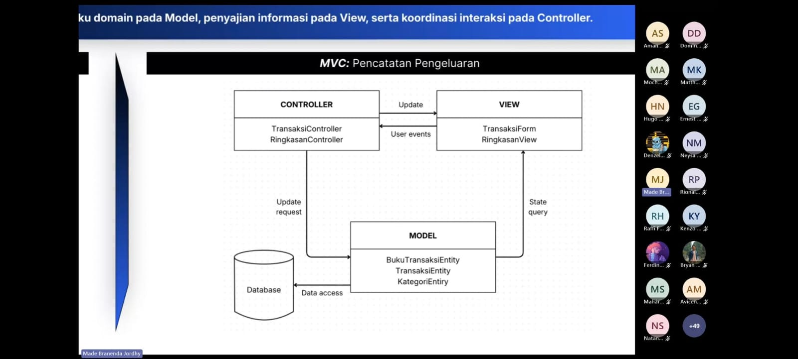

# Form Asistensi

## Tugas Besar IF2150 - Rekayasa Perangkat Lunak

| Informasi | Keterangan |
| --- | --- |
| **Hari** | *Jumat* |
| **Tanggal** | *02/10/2026* |
| **Kelas** | *K02* |
| **Nomor Kelompok** | *G03*  |
| **Nama Kelompok** | *LockedIn*  |
| **Nama Perangkat Lunak** | *Silembur*  |
| **Dokumen** | *K02_G03_RG*  |

### Anggota Kelompok

| NIM | Nama |
| --- | --- |
| *13525059* | *Muhammad Pandu Pulunggana* |
| *13525128* | *Mochamad Fachri Alfaridzi* |
| *13525101* | *Kevin Lincoln Hutabarat* |
| *13525035* | *Muhammad Dhiya Rafi* |
| *13525098* | *Satya Radhityan Yahya* |

### Catatan

| Catatan |
| --- |
| 1. MVC memisahkan pengelolaan data dan perilaku domain pada Model |
| 2. Layered Architecture mengorganisasikan sistem menjadi layers berdasarkan tanggung jawabnya |
| 3. Client server membagi sistem menjadi client yang meminta service dan server yang menyediakan sercive |
| 4. Repository architecture menggunakan model data bersama sebagai pusat pertukaran informasi antar komponen |
| 5. Pipe and Filter Architecture data mengalir melalui serangkaian tahap pemrosesan (filter) yang dihubungkan oleh saluran (pipe) |
| 6. Pada bab 2 tinggal dimasukkin komponen-komponen yang sudah dibuat pada bab 1 tergantung style arsitektur yang dipakai |
| 7. Pada bab 3 buat minimal 1 architecture view yang paling selaras dengan perangkat lunak yang dibuat |
| 8. Logical view mendeskripsikan abstraksi utama sistem |
| 9. Process view mendeskripsikan proses saat sistem berjalan |
| 10. Development view mendeskripsikan organisasi statis kode dalam package, modul, atau subsistem beserta dependasinya |
| 11. Physical view mendeskripsikan pemetaan komponen perangkat lunak pada perangkat keras atau node eksekusi beserta koneksi di antaranya |

## Dokumentasi

<!--  -->

  

  <i>Gambar 1. Dokumentasi kegiatan asistensi.</i>

