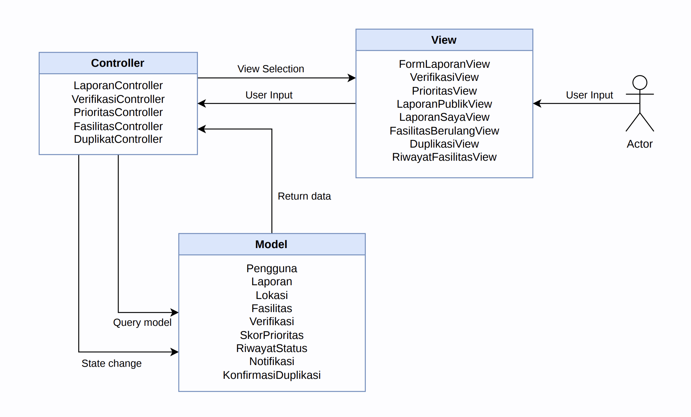
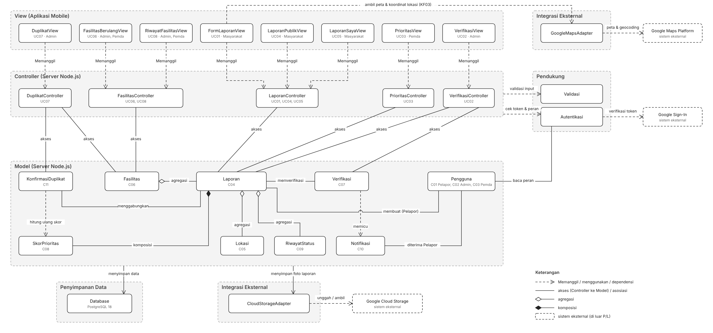
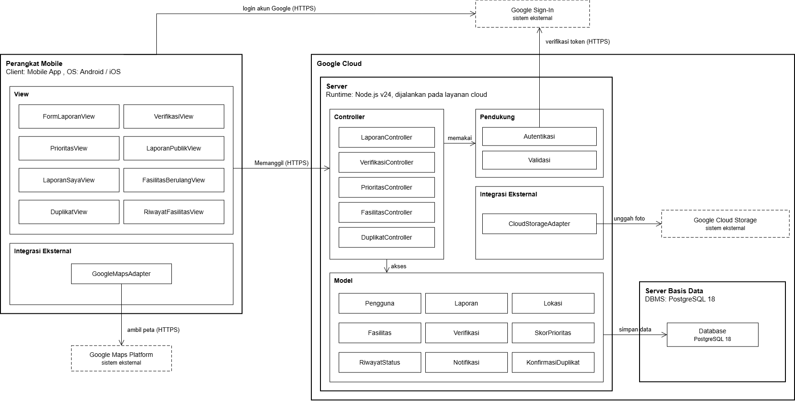

<h1>
IF2150 REKAYASA PERANGKAT LUNAK
 
TUGAS 6
 
ARSITEKTUR PERANGKAT LUNAK (APL)
</h1>
 

## *SILEMBUR*

### Untuk: *Amanda Aurellia Salsabila*

Dipersiapkan oleh:
| Informasi | Keterangan |
| --- | --- |
| Kelas | *K02* |
| Kelompok | *G03* |

Dipersiapkan oleh:

Dipersiapkan oleh:
| Informasi | Keterangan |
| --- | --- |
| Kelas | *K02* |
| Kelompok | *G03* |
| Nama Kelompok | LockedIn  |

| NIM       | Nama               |
| --------- | ------------------ |
| *13525059* | *Muhammad Pandu Pulunggana* |
| *13525128* | *Mochamad Fachri Alfaridzi* |
| *13525101* | *Kevin Lincoln Hutabarat* |
| *13525035* | *Muhammad Dhiya Rafi* |
| *13525098* | *Satya Radhityan Yahya* |

---

 
 

# BAB 1: Style/Pattern Arsitektur Acuan

Gaya arsitektur utama yang dipilih adalah MVC yang dibangun di atas pola klien-server. Bagian dan peran dari MVC, yaitu:
- Model: Menyimpan data dan logika bisnis. Model bertanggung jawab dalam manajemen data, termasuk pengambilan, penyimpanan, dan pemrosesan data. 
- View: Menampilkan data yang diberikan Model kepada pengguna.
- Controller: Menjadi penghubung antara Model dan View. Controller akan menerima input pengguna, memprosesnya, dan menentukan bagaimana data dari Model akan ditampilkan oleh View.

Gaya arsitektur utama MVC dipilih karena data berupa laporan pengguna dan fasilitas dapat ditampilkan dalam beberapa bentuk tergantung pengguna yang memintanya beserta usecase yang dijalankan. Misalnya:
- Ketika masyarakat umum mengakses laporan yang dibuat pengguna lain, view hanya menampilkan foto, lokasi, deskripsi, dan status tanpa identitas pelapor (berkaitan dengan KF10)
- Ketika masyarakat umum mengakses laporan yang dibuat dirinya sendiri, view menampilkan detail lengkap laporan berupa foto, lokasi, deskripsi, status, dan riwayat perubahan laporan (berkaitan dengan KF10, KF13, KF24)
- Ketika admin mengakses laporan masyarakat umum yang belum diverifikasi, view hanya menampilkan foto, lokasi, deskripsi laporan yang baru dibuat (berkaitan dengan KF06 dan KF07)
- Ketika pemerintah daerah mengakses menu laporan aktif, view menampilkan daftar laporan pengguna yang terurut berdasarkan skor prioritas (berkaitan dengan KF18)
- Ketika admin ingin mengonfirmasi laporan duplikat dengan melihat daftar laporan aktif, view menampilkan preview dari laporan aktif yang duplikat (berkaitan dengan KF20, KF21)
- Ketika admin atau pemerintah daerah mengakses dashboard, view menampilkan preview dari fasilitas yang mengalami kerusakan berulang (berkaitan dengan KF14)
- Ketika admin atau pemerintah daerah mengakses laporan yang dibuat pengguna, view menampilkan detail lengkap laporan berupa foto, lokasi, deskripsi, status, dan riwayat perubahan laporan (berkaitan dengan KF10, KF22, KF23)
Selain itu, model MVC juga membuat testing tampilan aplikasi lebih mudah dilakukan untuk setiap tipe pengguna dan use case yang dilaksanakan.

<i>Gambar 1. Contoh Arsitektur MVC</i>

Tabel 1.1. Lingkungan Operasi Perangkat Lunak

| Komponen | Spesifikasi |
| :--- | :--- |
| *Server* | *Node.js v24, dijalankan pada layanan cloud* |
| *Client* | *Mobile App* |
| *DBMS* | *PostgreSQL 18* |
| *OS* | *Android dan iOS* |
| *Runtime* | *Node.js v24* |
| *Cloud* | *Google Cloud* |

Model MVC dipilih karena bisa diterapkan untuk aplikasi mobile. MVC bisa diimplementasikan dengan JavaScript dengan membagi model, view, controller menjadi 3 modul atau folder yang berbeda, yang kemudian bisa digunakan untuk membangun aplikasi yang kemudian dihubungkan ke server dengan Node.js.

---

# BAB 2: Identifikasi Komponen / Modul / Subsistem

Tabel 2.1. Identifikasi Komponen/Modul/Subsistem

| Nama Komponen/Modul/Subsistem | Jenis                 | Penjelasan                                                                                                             |
| :---------------------------- | :-------------------- | :--------------------------------------------------------------------------------------------------------------------- |
| *FormLaporanView*             | *View*                | *Menampilkan formulir laporan berisi foto, lokasi, dan deskripsi kerusakan, lalu mengirimkannya ke LaporanController.* |
| *VerifikasiView*              | *View*                | *Menampilkan laporan yang menunggu verifikasi beserta pilihan setujui, tolak, atau minta revisi untuk admin.*          |
| *PrioritasView*               | *View*                | *Menampilkan laporan terverifikasi yang terurut berdasarkan skor prioritas kepada pemerintah daerah.*                  |
| *LaporanPublikView*           | *View*                | *Menampilkan laporan pengguna lain tanpa identitas pelapor.*                                                           |
| *LaporanSayaView*             | *View*                | *Menampilkan laporan milik pelapor beserta status, riwayat penanganan, dan notifikasi verifikasi.*                     |
| *FasilitasBerulangView*       | *View*                | *Menampilkan fasilitas yang menjadi kandidat evaluasi perbaikan permanen.*                                             |
| *DuplikatView*                | *View*                | *Menampilkan kandidat laporan duplikat dan konfirmasi penggabungan untuk admin.*                                       |
| *RiwayatFasilitasView*        | *View*                | *Menampilkan pencarian fasilitas dan riwayat perubahan status laporannya.*                                             |
| *LaporanController*           | *Controller*          | *Memproses pembuatan laporan, daftar laporan publik, serta status dan riwayat laporan milik pelapor.*                  |
| *VerifikasiController*        | *Controller*          | *Memproses keputusan verifikasi admin, mengirim notifikasi, dan memicu perhitungan skor prioritas.*                    |
| *PrioritasController*         | *Controller*          | *Memproses daftar laporan terverifikasi berdasarkan skor prioritas dan filternya.*                                     |
| *FasilitasController*         | *Controller*          | *Memproses daftar fasilitas dengan kerusakan berulang, pencarian fasilitas, dan riwayat statusnya.*                    |
| *DuplikatController*          | *Controller*          | *Memproses pencarian kandidat duplikat dan penggabungan laporan setelah dikonfirmasi admin.*                           |
| *Pengguna*                    | *Model*               | *Merepresentasikan akun dan peran pengguna, yaitu Pelapor, Admin, dan PemerintahDaerah.*                               |
| *Laporan*                     | *Model*               | *Merepresentasikan data laporan berupa foto, lokasi, deskripsi, kategori, dan status.*                                 |
| *Lokasi*                      | *Model*               | *Merepresentasikan koordinat dan wilayah laporan.*                                                                     |
| *Fasilitas*                   | *Model*               | *Merepresentasikan fasilitas umum dan menandainya jika laporan melewati ambang batas.*                                 |
| *Verifikasi*                  | *Model*               | *Merepresentasikan keputusan verifikasi beserta catatan alasannya.*                                                    |
| *SkorPrioritas*               | *Model*               | *Menghitung skor prioritas laporan.*                                                                                   |
| *RiwayatStatus*               | *Model*               | *Mencatat setiap perubahan status laporan.*                                                                            |
| *Notifikasi*                  | *Model*               | *Merepresentasikan pesan hasil verifikasi untuk pelapor.*                                                              |
| *KonfirmasiDuplikat*          | *Model*               | *Menyimpan kandidat duplikat dan menggabungkannya menjadi satu laporan induk.*                                         |
| *Autentikasi*                 | *Pendukung*           | *Memeriksa token Google Sign-In dan membatasi akses sesuai peran pengguna.*                                            |
| *Validasi*                    | *Pendukung*           | *Memeriksa kelengkapan dan format input sebelum diproses controller.*                                                  |
| *GoogleMapsAdapter*           | *Integrasi Eksternal* | *Menghubungkan aplikasi dengan Google Maps Platform untuk menampilkan dan memilih lokasi.*                             |
| *CloudStorageAdapter*         | *Integrasi Eksternal* | *Menghubungkan aplikasi dengan Google Cloud Storage untuk menyimpan foto laporan.*                                     |
| *Database*                    | *Penyimpanan Data*    | *Basis data PostgreSQL 18 yang menyimpan seluruh data Model.*                                                          |
---

# BAB 3: Model Arsitektur Perangkat Lunak

## 3.1 Logical View

*Logical View* dipilih karena paling langsung memperlihatkan penerapan MVC pada SILEMBUR. Diagram ini menunjukkan *controller* mana yang menangani setiap layar, *model* mana yang diakses setiap *controller*, dan bagaimana *model* saling berhubungan. Informasi tersebut menjadi panduan pembagian modul saat implementasi.

<i>Gambar 2. Logical View SILEMBUR</i>

Seluruh komponen pada Tabel 2.1 digambarkan dan dikelompokkan menjadi *View*, *Controller*, *Model*, *Pendukung*, *Integrasi Eksternal*, dan *Penyimpanan Data*. Setiap *View* diberi keterangan use case dan aktor yang memakainya. Garis "Memanggil" menunjukkan *View* yang meneruskan aksi pengguna ke *Controller*, sedangkan garis "akses" menunjukkan *Controller* yang membaca atau mengubah *Model*. Hubungan antar-*Model* mengikuti diagram kelas keseluruhan pada SKPL. Fasilitas mengagregasi Laporan, Laporan mengagregasi Lokasi dan RiwayatStatus, serta Laporan tersusun atas (komposisi) SkorPrioritas. Karena Lokasi, RiwayatStatus, dan SkorPrioritas merupakan bagian dari Laporan, *controller* mengaksesnya melalui Laporan, tidak secara langsung. Seluruh *controller* memakai Autentikasi dan Validasi sebelum memproses permintaan. Layanan Google di luar P/L, yaitu Google Maps Platform, Google Sign-In, dan Google Cloud Storage, digambarkan dengan garis putus-putus.

## 3.2 Physical View

Physical View dipilih karena SILEMBUR berjalan di dua lingkungan yang terpisah yaitu perangkat mobile milik pengguna dan server di Google Cloud. View ini melengkapi Logical View dengan menunjukkan di node mana setiap komponen pada Tabel 2.1 dijalankan dan bagaimana node-node tersebut saling berkomunikasi sesuai lingkungan operasi pada Tabel 1.1.

<i>Gambar 3. Physical View SILEMBUR</i>

Semua komponen View dan GoogleMapsAdapter berjalan di aplikasi mobile pada Android dan iOS. View memanggil Controller di server melalui HTTPS. Controller, Model, Pendukung, dan CloudStorageAdapter berjalan di server Node.js v24 pada Google Cloud. Data Model tersimpan di PostgreSQL 18 dan foto laporan tersimpan di Google Cloud Storage. Login dan verifikasi token memakai Google Sign In. Peta diambil dari Google Maps Platform. Controller dan Model ditempatkan di server agar aturan bisnis tidak bisa dilewati dari aplikasi dan Android maupun iOS memakai logika yang sama.

---

# Referensi

- Sommerville, I. (2016). *Software Engineering* (10th ed.). Pearson. Chapter 6: *Architectural Design*: [https://software-engineering-book.com/slides/](https://software-engineering-book.com/slides/)
- Diagram arsitektur: [https://www.drawio.com/](https://www.drawio.com/), [https://staruml.io/](https://staruml.io/)
